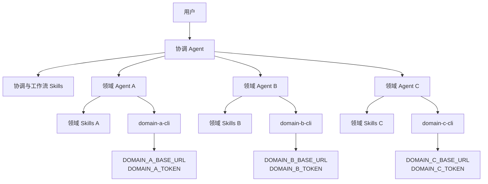
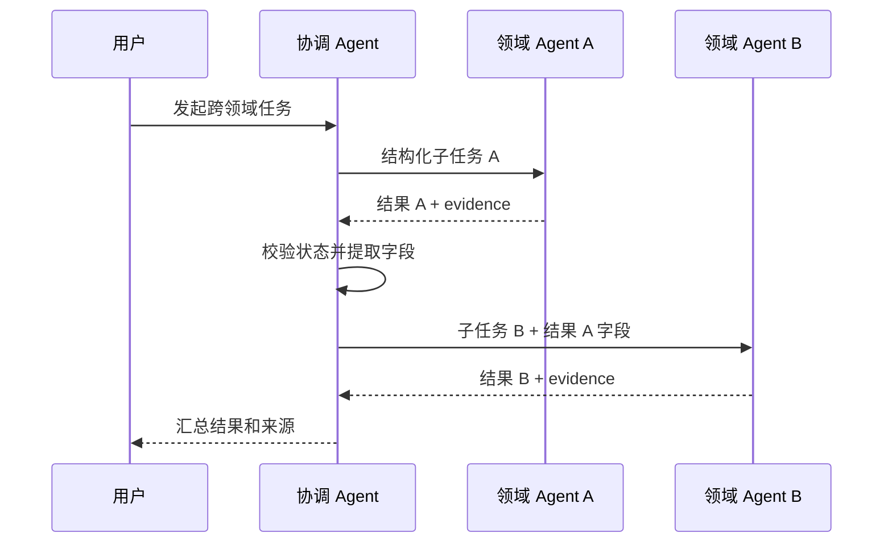

# 通用多 Agent、多 Skills 与独立 CLI 组合方案

## 1. 方案摘要

本方案面向多个领域能力需要协同完成任务的通用场景，不依赖任何具体主系统。每个领域可以从 OpenAPI 或 MCP 描述生成一个或多个独立 CLI 及原子 Skill。组合阶段再生成一个 Agent Team Bundle，供协调 Agent 和多个领域 Agent 加载。

推荐使用以下分工：

- 协调 Agent：理解用户意图、拆分任务、选择领域 Agent、汇总结果；
- 领域 Agent：只加载职责范围内的 Skills，只调用获准的 CLI；
- 工作流 Skill：声明跨 Agent 调用顺序、输入输出映射、确认点和失败策略；
- 独立 CLI：连接各自的 Base URL，并使用各自的 token。



组合的是 Agent 配置、Skills、工具授权和协作规则，不把多个 CLI 合并为一个二进制，也不要求增加统一 API 网关。

## 2. 建设目标

- 支持任意数量的 Agent、Skills 和独立 CLI。
- 一个领域 Agent 可以加载多个 Skill，也可以获准使用多个 CLI。
- 同一个 CLI 只读取自己的 Base URL 和认证变量。
- 协调 Agent 默认不持有业务 token，也不直接调用领域 CLI。
- 支持 Agent 之间传递结构化任务和结果。
- 支持跨 Agent 的查询、分析和写入工作流。
- Skill、组合清单和日志不保存 token 值。
- 原子 Skill 更新后可以重复组合得到一致制品。

## 3. 非目标

第一阶段不实现：

- 在线 Agent 或 Skill 注册中心；
- 统一网络代理或 API 网关；
- Secret 签发、刷新和托管服务；
- 分布式事务和自动补偿；
- 任意动态代码执行；
- 根据接口描述自动推断真实业务流程。

## 4. 分层模型

### 4.1 原子 Skill

原子 Skill 描述一个命令组或一类能力，包括触发条件、命令、参数、返回字段、风险和错误处理。它由 `opencli generate` 生成，可以由维护者补充业务语义。

### 4.2 领域 Agent

领域 Agent 是最小权限执行者。每个 Agent Profile 声明：

- 职责和不负责事项；
- 可加载的 Skill；
- 可执行的 CLI；
- 可见的环境变量名称；
- 可接受的任务类型；
- 必须返回的结构化结果。

领域 Agent 不需要知道整个团队的全部 Skills。

### 4.3 协调 Agent

协调 Agent 只加载团队路由和工作流 Skills，负责：

1. 判断任务是否需要多个领域；
2. 拆分为有依赖关系的子任务；
3. 把子任务发送给对应领域 Agent；
4. 校验领域 Agent 返回的结构化结果；
5. 决定继续、停止、请求确认或请求补充信息；
6. 汇总最终结果及其来源。

协调 Agent 默认不直接执行领域 CLI，以降低凭据暴露和越权风险。

### 4.4 工作流 Skill

工作流 Skill 记录跨 Agent 的确定性协作知识，包括 Agent 选择、步骤依赖、字段映射、确认点、回读验证和部分失败处理。

## 5. 制品生成流程

先为各领域生成独立 CLI 与 Skills：

```bash
opencli generate \
  --input ./domain-a/openapi.yaml \
  --config ./domain-a/opencli.yaml \
  --output ./generated/domain-a \
  --module example.com/domain-a-cli \
  --app domain-a-cli
```

其他领域采用相同方式独立生成。然后组合 Agent Team Bundle：

```bash
opencli compose \
  --config ./agent-team.yaml \
  --output ./dist/agent-team
```

`opencli compose` 只读本地配置和 Skill 文件，不连接业务系统，也不读取 token 值。

## 6. Agent Team 配置

`agent-team.yaml` 示例：

```yaml
version: v1

team:
  name: operations-team
  description: 通用多领域协作 Agent 团队

coordinator:
  id: coordinator
  skills:
    - ./coordination/skills

agents:
  - id: domain-a-agent
    description: 负责领域 A 的查询和操作
    skills:
      - ./generated/domain-a/skills
    tools:
      - binary: domain-a-cli
        base_url_env: DOMAIN_A_BASE_URL
        token_env: DOMAIN_A_TOKEN

  - id: domain-b-agent
    description: 负责领域 B 的查询和分析
    skills:
      - ./generated/domain-b/skills
    tools:
      - binary: domain-b-cli
        base_url_env: DOMAIN_B_BASE_URL
        token_env: DOMAIN_B_TOKEN

  - id: domain-c-agent
    description: 负责领域 C 的查询和操作
    skills:
      - ./generated/domain-c/skills
    tools:
      - binary: domain-c-cli
        base_url_env: DOMAIN_C_BASE_URL
        token_env: DOMAIN_C_TOKEN

workflows:
  - ./coordination/workflows
```

一个 Agent 可以声明多个 `skills` 和多个 `tools`，因此配置模型不把 Agent、Skill 和 CLI 强制为一对一关系。

## 7. CLI 独立配置

每个 CLI 的 `opencli.yaml` 支持显式环境变量名称：

```yaml
runtime:
  base_url_env: DOMAIN_A_BASE_URL
  auth_token_env: DOMAIN_A_TOKEN
  default_output: json
```

规则如下：

- 配置和 Skill 中只出现环境变量名称；
- 环境变量值由 Agent Runtime 或 Secret 管理系统注入；
- 每个领域 Agent 只能看到自身工具需要的变量；
- 协调 Agent 默认看不到任何领域 token；
- 未配置新字段的单 CLI 项目继续使用 `OPENCLI_BASE_URL` 和 `OPENCLI_AUTH_TOKEN`；
- 同一 Agent 下不同 CLI 复用同一 token 变量时给出警告；跨安全域复用时应视为配置错误。

### 7.1 放在哪个文件

推荐把“变量名称”“Agent 与 CLI 的绑定”“生成后的运行时声明”“变量真实值”分开保存：

```text
project/
├── configs/
│   ├── clis/
│   │   ├── domain-a/opencli.yaml       # CLI A 的变量名称
│   │   ├── domain-b/opencli.yaml       # CLI B 的变量名称
│   │   └── domain-c/opencli.yaml       # CLI C 的变量名称
│   └── teams/
│       └── operations/agent-team.yaml  # Agent、Skills、CLI 及变量名称的绑定
├── generated/
│   ├── domain-a/                       # opencli generate 输出
│   ├── domain-b/
│   └── domain-c/
└── dist/
    └── agent-team/                     # opencli compose 输出
```

每个 CLI 的 `opencli.yaml` 是变量名称的源配置：

```yaml
runtime:
  base_url_env: DOMAIN_A_BASE_URL
  auth_token_env: DOMAIN_A_TOKEN
```

`agent-team.yaml` 不保存值，只声明哪个 Agent 使用哪个 CLI，以及运行时需要给该 Agent 注入哪些变量：

```yaml
agents:
  - id: domain-a-agent
    skills:
      - ../../../generated/domain-a/skills
    tools:
      - binary: domain-a-cli
        base_url_env: DOMAIN_A_BASE_URL
        token_env: DOMAIN_A_TOKEN
```

`opencli compose` 会把这份公开声明生成到：

```text
dist/agent-team/agents/domain-a-agent/profile.yaml
```

Profile 仍然只包含变量名称。token 真值不放在 `opencli.yaml`、`agent-team.yaml`、Profile 或 Skill 中，而是在启动 Agent Runtime 时由部署环境注入：

```bash
export DOMAIN_A_BASE_URL='https://domain-a.example.com'
export DOMAIN_A_TOKEN='***'
```

生产环境应使用 Kubernetes Secret、容器平台 Secret 或同类凭据系统。用于本地调试的 `.env` 必须加入 `.gitignore`，而且需要由启动脚本或 Agent Runtime 显式加载；生成 CLI 本身不默认读取 `.env` 文件。

### 7.2 当前实现状态

上述 `base_url_env` 和 `auth_token_env` 是本方案需要新增的能力。当前仓库的 `internal/configgen/config.go` 尚无这两个字段，Go/Rust 生成模板仍直接读取 `OPENCLI_BASE_URL` 和 `OPENCLI_AUTH_TOKEN`。因此在完成“独立 CLI 配置”阶段之前，三个 CLI 只能通过进程级环境隔离来复用这两个固定变量名。

## 8. 组合输出

```text
agent-team/
├── manifest.yaml
├── README.md
├── coordinator/
│   ├── profile.yaml
│   └── skills/
│       ├── SKILL.md
│       └── workflows/
├── agents/
│   ├── domain-a-agent/
│   │   ├── profile.yaml
│   │   └── skills/
│   ├── domain-b-agent/
│   │   ├── profile.yaml
│   │   └── skills/
│   └── domain-c-agent/
│       ├── profile.yaml
│       └── skills/
└── workflows/
    └── cross-domain-query/
        └── SKILL.md
```

每个 Agent 目录是独立加载单元。组合器为 Skill 名称增加团队和 Agent 命名空间，避免不同来源存在同名 Skill 时发生覆盖。

## 9. Agent 协作契约

协调 Agent 向领域 Agent 发送结构化任务：

```json
{
  "task_id": "task-001",
  "intent": "query_domain_record",
  "inputs": {
    "entity_id": "12345"
  },
  "expected_outputs": ["record_key"],
  "constraints": {
    "read_only": true
  }
}
```

领域 Agent 返回结构化结果：

```json
{
  "task_id": "task-001",
  "status": "success",
  "data": {
    "record_key": "ABC-001"
  },
  "evidence": {
    "agent": "domain-a-agent",
    "cli": "domain-a-cli",
    "command": "record get",
    "exit_code": 0
  },
  "errors": []
}
```

协调 Agent 只依赖该协作契约，不解析领域 Agent 的自然语言推理过程。领域 Agent 不返回 token、Authorization Header 或其他 Secret。

## 10. 跨 Agent 工作流

示例：Agent A 查询得到关联键，Agent B 使用该键继续分析。

```yaml
name: cross-domain-query
description: 从领域 A 查询关联键，再由领域 B 查询分析结果

steps:
  - id: get_record
    agent: domain-a-agent
    intent: query_domain_record
    inputs:
      entity_id: ${user.entity_id}
    outputs:
      record_key: $.data.record_key

  - id: analyze_record
    agent: domain-b-agent
    intent: analyze_domain_record
    depends_on: [get_record]
    inputs:
      record_key: ${get_record.record_key}
```

第一阶段该结构是工作流 Skill 中的可验证描述，不新增通用执行 DSL。协调 Agent 仍按 Skill 逐步委派任务。



## 11. 权限与安全

- 协调 Agent 只具备委派能力，不默认具备业务 CLI 执行权限。
- 领域 Agent 使用 CLI allowlist，不能调用未声明的二进制。
- Agent Runtime 按 Agent Profile 注入最小环境变量集合。
- 子任务只传业务字段，不传 token 或完整请求头。
- 写入、删除、批量和不可逆任务必须在协调 Agent 层获得明确确认。
- 领域 Agent 执行写入后必须回读验证并返回 evidence。
- 日志记录 Agent、Skill、CLI、命令名、退出码和耗时，但对参数中的敏感字段脱敏。

## 12. 失败处理

| 场景 | 处理方式 |
| --- | --- |
| 找不到匹配 Agent | 协调 Agent 停止并报告缺失能力 |
| Agent 缺少 Skill | 不临时加载未授权目录，返回配置错误 |
| CLI 未安装 | 领域 Agent 返回缺失二进制错误 |
| Base URL 或 token 缺失 | 领域 Agent 只报告变量名称，不输出 Secret |
| CLI 认证失败 | 停止当前子任务，不尝试其他 Agent 的 token |
| 子任务输出缺少字段 | 协调 Agent 不启动依赖步骤 |
| 某个只读分支失败 | 按工作流声明决定整体失败或返回部分结果 |
| 写入后回读失败 | 返回“写入已提交、验证未完成” |
| 多 Agent 部分写入失败 | 不自动补偿，报告成功步骤和恢复建议 |

## 13. OpenCLI 改造范围

### 13.1 独立 CLI 配置

- 扩展 `internal/configgen.RuntimeConfig`；
- 更新规划模型以及 Go、Rust 生成运行时；
- 更新生成 Skill 和 README；
- 保持旧环境变量名称的兼容默认值。

### 13.2 Agent Team 组合模块

新增 `internal/compose`，内部负责：

- 加载并验证 `agent-team.yaml`；
- 读取多个 Skill 来源；
- 建立 Team、Agent 和 Skill 命名空间；
- 重写 Skill frontmatter 和相对引用；
- 生成协调 Agent 与领域 Agent Profile；
- 合并工作流 Skills；
- 生成 `manifest.yaml` 和 README；
- 在临时目录验证完成后原子发布。

组合模块不依赖具体 Agent 框架，不启动 Agent，不执行 CLI，也不读取 Secret。

### 13.3 命令入口

在 `internal/app` 增加：

```bash
opencli compose --config ./agent-team.yaml --output ./dist/agent-team
```

组合配置使用独立模型，不扩充现有单 CLI `opencli.yaml` 的职责。

### 13.4 验证器

扩展 `skills-verify`，构建一个协调 Agent 和至少两个领域 Agent，验证：

- 各 Agent 只加载自己的 Skills；
- 各领域 Agent 只能执行自己的 CLI；
- 协调 Agent 能按工作流委派两个连续子任务；
- 上一步结构化输出可以进入下一步；
- token 不会出现在消息、日志和生成文件中。

## 14. 实施阶段

1. **独立 CLI 配置**：支持自定义 Base URL/token 环境变量名称。
2. **Team Bundle 生成**：实现 Agent、Skill、CLI 和工作流组合清单。
3. **多 Agent 验证**：扩展验证器并完成一个只读跨 Agent 流程。
4. **写入治理**：增加确认、回读验证、审计和部分失败规范。

## 15. 验收标准

- 可以组合至少三个 Agent、多个 Skill 和三个独立 CLI。
- 一个 Agent 可以声明多个 Skills 和多个 CLI。
- 每个领域 Agent 只能看到自己的工具和环境变量。
- 协调 Agent 不持有领域 token，也不直接执行领域 CLI。
- 同名 Skill 在不同 Agent 命名空间下不会冲突。
- 两个领域 Agent 可以通过结构化结果完成连续只读任务。
- 缺少 Agent、Skill、CLI、环境变量或输出字段时不会继续依赖步骤。
- Skill、Profile、清单、日志和 Agent 消息不包含 token 值。
- 现有单 CLI 的 Go、Rust、OpenAPI 和 MCP 生成行为保持兼容。

更详细的实现设计见 [通用多 Agent、多 Skills 与独立 CLI 组合设计](superpowers/specs/2026-07-14-multi-agent-multi-skills-cli-design.md)。
