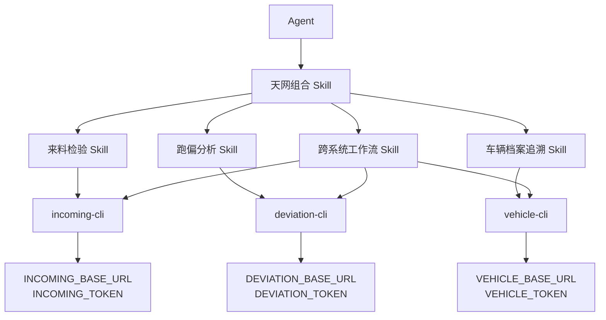
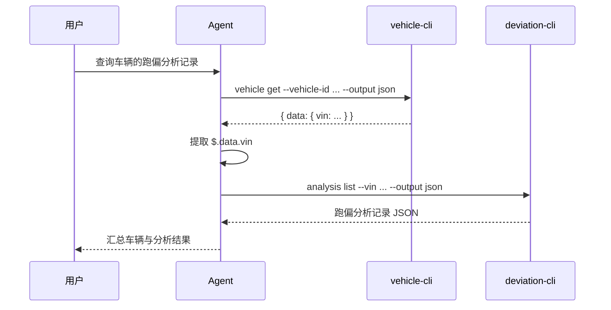

# 天网平台多系统 Skills 与独立 CLI 组合方案

## 1. 方案摘要

天网平台及来料检验、跑偏分析、车辆档案追溯等子系统分别生成独立 CLI。每个 CLI 独立连接自己的服务地址并使用自己的 token。OpenCLI 在这些原子制品之上增加构建期组合能力，把多个系统的 Skill 包、路由规则和跨系统工作流生成一个 Agent 可加载的组合 Skill 包。

本方案不合并 CLI 二进制，也不增加统一请求代理。Agent 加载一个组合 Skill 目录，根据任务选择系统 Skill，并按工作流依次调用多个 CLI。



## 2. 建设目标

- 每个系统继续独立生成、发布和升级 CLI。
- 每个 CLI 使用独立的 Base URL 和认证 token。
- Agent 只加载一个组合 Skill 目录即可发现全部系统能力。
- 支持同一任务按顺序调用多个 CLI。
- 支持把上一步 JSON 输出字段传给下一步命令。
- 保持系统权限隔离，Skill 文件中不保存 token 值。
- 子系统变化后可以通过重新生成和组合得到一致制品。

## 3. 核心原则

### 3.1 CLI 独立

组合的是知识和路由，不是二进制。三个系统仍然产生三个 CLI：

```text
incoming-cli
deviation-cli
vehicle-cli
```

Agent 运行环境需要安装这些 CLI，并将其加入允许执行的命令列表。

### 3.2 凭据隔离

每个 CLI 使用独立环境变量：

| 系统 | CLI | Base URL | Token |
| --- | --- | --- | --- |
| 来料检验 | `incoming-cli` | `INCOMING_BASE_URL` | `INCOMING_TOKEN` |
| 跑偏分析 | `deviation-cli` | `DEVIATION_BASE_URL` | `DEVIATION_TOKEN` |
| 车辆档案追溯 | `vehicle-cli` | `VEHICLE_BASE_URL` | `VEHICLE_TOKEN` |

组合配置和 Skill 只声明环境变量名称。变量值由 Secret 管理系统或 Agent 部署环境注入，不进入代码仓库、Skill、组合清单或日志。

### 3.3 Skill 分层

- 原子 Skill：描述单个命令组的命令、参数和安全要求。
- 系统路由 Skill：在一个系统内部选择命令组。
- 天网根 Skill：在多个系统和跨系统工作流之间进行选择。
- 工作流 Skill：描述多 CLI 的调用顺序、字段映射和失败处理。

根 Skill 保持轻量，不复制所有子系统命令内容。

## 4. 生成流程

每个系统先独立生成 CLI：

```bash
opencli generate \
  --input ./incoming/openapi.yaml \
  --config ./incoming/opencli.yaml \
  --output ./generated/incoming \
  --module example.com/incoming-cli \
  --app incoming-cli

opencli generate \
  --input ./deviation/openapi.yaml \
  --config ./deviation/opencli.yaml \
  --output ./generated/deviation \
  --module example.com/deviation-cli \
  --app deviation-cli

opencli generate \
  --input ./vehicle/openapi.yaml \
  --config ./vehicle/opencli.yaml \
  --output ./generated/vehicle \
  --module example.com/vehicle-cli \
  --app vehicle-cli
```

再生成组合 Skill 包：

```bash
opencli compose \
  --config ./multi-system.yaml \
  --output ./dist/sky-skills
```

## 5. 单系统运行时配置

为支持同一 Agent 进程中的多个 CLI，`opencli.yaml` 的运行时配置增加环境变量名称：

```yaml
runtime:
  base_url_env: INCOMING_BASE_URL
  auth_token_env: INCOMING_TOKEN
  default_output: json
```

未配置时继续使用现有默认变量 `OPENCLI_BASE_URL` 和 `OPENCLI_AUTH_TOKEN`，保证已有单系统项目兼容。多系统组合时，如果两个系统复用相同的 Base URL 或 token 环境变量名，组合命令直接报错。

## 6. 多系统组合配置

`multi-system.yaml` 示例：

```yaml
version: v1

suite:
  name: sky-platform
  description: 天网平台多系统能力入口

systems:
  - id: incoming
    name: 来料检验
    binary: incoming-cli
    skills_dir: ./generated/incoming/skills
    base_url_env: INCOMING_BASE_URL
    token_env: INCOMING_TOKEN

  - id: deviation
    name: 跑偏分析
    binary: deviation-cli
    skills_dir: ./generated/deviation/skills
    base_url_env: DEVIATION_BASE_URL
    token_env: DEVIATION_TOKEN

  - id: vehicle
    name: 车辆档案追溯
    binary: vehicle-cli
    skills_dir: ./generated/vehicle/skills
    base_url_env: VEHICLE_BASE_URL
    token_env: VEHICLE_TOKEN

workflows_dir: ./workflows
```

配置只保存各系统的公开标识、二进制名称、Skill 路径和环境变量名称。

## 7. 组合 Skill 输出

```text
sky-skills/
├── SKILL.md
├── manifest.yaml
├── README.md
├── systems/
│   ├── incoming/
│   │   ├── SKILL.md
│   │   └── groups/
│   ├── deviation/
│   │   ├── SKILL.md
│   │   └── groups/
│   └── vehicle/
│       ├── SKILL.md
│       └── groups/
└── workflows/
    ├── quality-trace/
    │   └── SKILL.md
    └── deviation-trace/
        └── SKILL.md
```

系统 ID 形成路径命名空间。不同系统即使存在同名命令组，也不会互相覆盖。

## 8. Agent 如何使用

Agent 的执行环境加载 `sky-skills/`，同时允许执行三个业务 CLI。处理任务时：

1. 读取根 `SKILL.md`，判断任务属于单系统还是跨系统工作流。
2. 读取对应系统或工作流的 `SKILL.md`。
3. 检查所需 CLI 是否存在，以及声明的环境变量是否已配置。
4. 使用 JSON 输出执行第一个 CLI 命令。
5. 检查退出码并从声明的 JSON 路径提取字段。
6. 把字段作为参数传给下一个 CLI。
7. 对写入操作进行明确确认，并在写入后回读验证。
8. 汇总各系统结果和失败位置，返回给用户。

Agent 不应把多个 CLI 拼成不可观察的 shell 管道。每一步单独执行和校验，避免一个系统失败后继续使用无效数据。

## 9. 跨系统工作流示例

场景：用户输入车辆标识，先查询车辆档案获得 VIN，再查询跑偏分析记录。



工作流 Skill 需要明确：

```yaml
name: deviation-trace
description: 根据车辆标识查询档案并关联跑偏分析记录

steps:
  - id: get_vehicle
    system: vehicle
    command: vehicle-cli vehicle get
    inputs:
      vehicle_id: ${user.vehicle_id}
    outputs:
      vin: $.data.vin

  - id: list_deviation
    system: deviation
    command: deviation-cli analysis list
    inputs:
      vin: ${get_vehicle.vin}
```

第一阶段该结构用于清晰描述工作流，不新增自动执行 DSL。具体命令仍由 Agent 按 Skill 逐步调用。

## 10. 失败处理

| 失败场景 | 处理方式 |
| --- | --- |
| CLI 未安装 | 停止并报告缺失的二进制名称 |
| Base URL 或 token 变量缺失 | 停止对应系统调用，只报告变量名称 |
| token 无效或权限不足 | 停止工作流，不尝试其他系统的 token |
| 第一步查询无结果 | 不执行依赖步骤，请求补充有效标识 |
| JSON 字段不存在 | 停止并报告预期字段路径和实际命令 |
| 中间 CLI 返回非零退出码 | 不执行后续依赖步骤 |
| 写入成功但回读失败 | 报告“写入已提交、验证未完成” |
| 多系统部分写入失败 | 列出成功和失败步骤，提供人工恢复建议 |

第一阶段不做自动补偿或分布式事务。

## 11. OpenCLI 改造范围

### 11.1 独立环境变量

- 扩展 `internal/configgen.RuntimeConfig`。
- 把变量名称传入规划模型。
- 更新 Go 和 Rust 运行时读取逻辑。
- 更新 Skill 和 README 模板。
- 保持旧配置默认行为不变。

### 11.2 组合模块

新增 `internal/compose`，负责：

- 读取和验证 `multi-system.yaml`；
- 检查输入 Skill 包；
- 建立系统命名空间；
- 重写 Skill 名称和相对引用；
- 合入人工工作流；
- 生成根路由、系统路由、README 和清单；
- 使用临时目录完成生成后原子发布。

组合模块不连接业务系统、不创建 CLI 进程、不读取 token 值。

### 11.3 命令入口

在 `internal/app` 增加 `compose` 命令并接入根命令。组合配置使用独立模型，不继续扩大单系统 `opencli.yaml` 的职责。

### 11.4 Agent 验证

扩展 `skills-verify`：

- 加载组合 Skill 根目录；
- 允许执行多个声明的 CLI；
- 验证 Agent 能选择正确系统；
- 验证两个只读 CLI 的顺序调用和字段传递；
- 验证日志和生成内容不存在 token 泄漏。

## 12. 实施阶段

### 阶段一：独立 CLI 配置

让每个生成 CLI 支持独立的 Base URL 和 token 环境变量，并完成 Go、Rust、Skill 和兼容性测试。

### 阶段二：组合 Skill 生成

实现 `multi-system.yaml`、`opencli compose`、系统命名空间、根路由和组合清单。

### 阶段三：跨系统工作流验证

确定工作流 Skill 模板，增加多 CLI Agent 验证用例，并完成一个真实的只读跨系统流程。

## 13. 验收标准

- 三个 CLI 能在同一 Agent 环境中使用三套独立地址和 token。
- Agent 只加载一个组合 Skill 目录即可发现三个系统。
- 同名命令组不会覆盖或误路由。
- Agent 能把第一个 CLI 的 JSON 字段传给第二个 CLI。
- 缺少 CLI、环境变量或中间字段时停止后续步骤。
- Skill、清单、生成报告和日志均不包含 token 值。
- 子系统 Skill 更新后可以重复执行 `opencli compose` 得到一致结果。
- 现有单系统 Go、Rust、OpenAPI 和 MCP 生成能力保持兼容。

## 14. 后续演进

系统数量明显增加或需要集中权限治理时，再评估：

- 在线 Skill 注册中心；
- 凭据代理与短期 token；
- 确定性工作流执行器；
- 审批、审计和调用策略；
- 微应用路由和页面上下文协议。

这些能力不进入第一阶段，避免在组合 Skill 尚未验证前引入新的在线基础设施。

更详细的实现级设计见 [多系统 Skills 与独立 CLI 组合设计](superpowers/specs/2026-07-14-multi-system-skills-cli-composition-design.md)。
