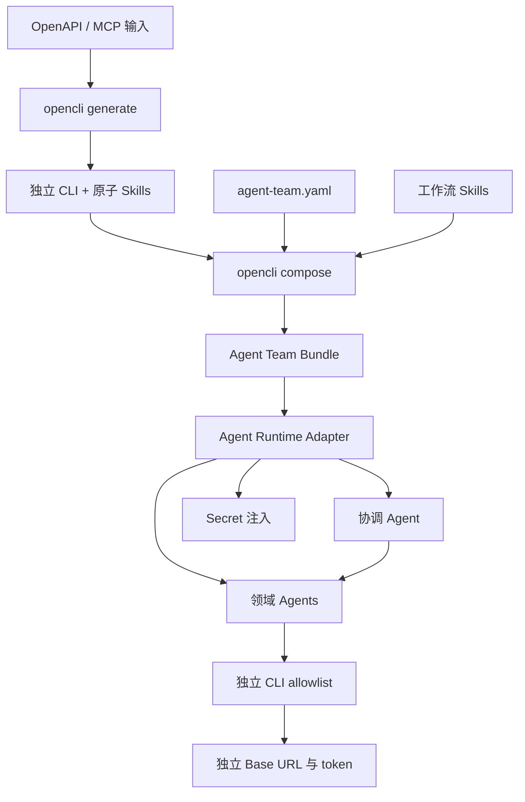
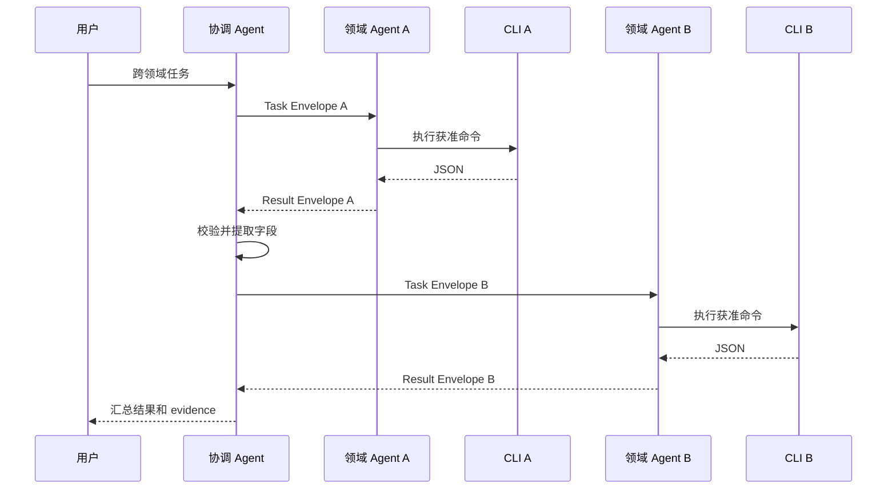

# 通用多 Agent、多 Skills 与独立 CLI 组合设计

## 1. 背景

OpenCLI 当前以单个 OpenAPI 或 MCP 输入为单位生成独立 CLI，并为每个命令组生成 Skill。一个生成项目内部可以通过根 Skill 在多个命令组之间路由，但不同生成项目仍相互独立。

实际使用中，一个任务可能需要多个领域能力。各领域有独立 CLI、Base URL、token、权限和发布节奏。目标不是建立某个业务主系统的专属方案，而是形成可复用的多 Agent、多 Skills、多 CLI 组合机制。

## 2. 设计目标

构建一个 Agent Team Bundle，使 Agent Runtime 可以根据清单创建：

- 一个协调 Agent；
- 任意数量的领域 Agent；
- 每个 Agent 对应的 Skill 集和 CLI allowlist；
- 独立的运行时环境变量声明；
- 跨 Agent 工作流 Skills。

核心安全目标是最小权限：协调 Agent 负责路由但不持有领域凭据，领域 Agent 只获得完成自身任务所需的 Skills、CLI 和环境变量。

## 3. 范围

### 3.1 包含

- 可配置 Base URL/token 环境变量名称；
- Agent Team 组合配置；
- `opencli compose` 命令；
- Agent、Skill 和 CLI 多对多声明；
- Team、Agent、Skill 命名隔离；
- Agent Profile 与机器可读清单；
- 工作流 Skill；
- 结构化任务和结果契约；
- 组合期验证和多 Agent 验证器。

### 3.2 不包含

- 在线 Agent/Skill 注册中心；
- 固定的 Agent 框架适配；
- Secret 存储服务；
- 统一业务 API 网关；
- 通用工作流执行器；
- 分布式事务和自动补偿。

## 4. 设计原则

### 4.1 生成与执行分离

OpenCLI 负责生成 CLI、Skills、Profiles 和清单。Agent Runtime 负责创建 Agent、注入 Secret、限制工具和执行协作。生成阶段不连接业务 endpoint。

### 4.2 组合知识，不合并二进制

CLI 继续独立生成和发布。Team Bundle 只组合 Agent 配置、Skill 文档、工具声明和工作流。

### 4.3 最小权限

每个领域 Agent 只加载自己的 Skill 来源，只允许执行 Profile 中声明的 CLI，只能看到工具声明需要的环境变量。协调 Agent 默认没有业务 CLI 和业务 token。

### 4.4 结构化协作

Agent 之间通过 Task Envelope 和 Result Envelope 交换数据。工作流依赖结构化字段，不依赖自然语言推理文本。

### 4.5 框架无关

组合输出不绑定某个 Agent SDK。不同 Runtime 通过 Adapter 把通用 Profile 映射到具体的 Agent、Skill Loader、工具 allowlist 和环境注入机制。

## 5. 总体架构



## 6. 模块与接口

### 6.1 原子生成模块

现有 `opencli generate` 仍以一个 CLI 为输出单位。新增的运行时字段只解决独立环境变量命名，不感知 Agent Team。

接口：

```bash
opencli generate --input <spec> --config <opencli.yaml> --output <dir> ...
```

### 6.2 组合模块

新增 `internal/compose`，在以下 seam 提供单一外部接口：

```go
type Request struct {
    ConfigPath string
    OutputDir  string
}

func Compose(ctx context.Context, request Request) error
```

调用者只需知道配置路径和输出路径。配置加载、验证、命名、复制、引用重写、模板渲染和原子发布均属于内部实现。

组合模块不依赖 Cobra、Agent SDK、业务 CLI 进程或 Secret Provider。

### 6.3 Runtime Adapter

Runtime Adapter 不进入第一阶段 OpenCLI 运行时实现，但 Team Bundle 的清单必须支持 Adapter 完成：

- 创建协调 Agent 和领域 Agent；
- 为每个 Agent 配置 Skill Loader；
- 设置 CLI allowlist；
- 按 Agent 注入环境变量；
- 建立协调 Agent 到领域 Agent 的委派能力。

只有出现第二种实际 Agent Runtime 时才抽取公共 Adapter 接口；第一阶段先在 `skills-verify` 中完成一个具体适配。

## 7. 单 CLI 配置扩展

`internal/configgen.RuntimeConfig` 增加：

```go
type RuntimeConfig struct {
    AuthHeader    string `yaml:"auth_header"`
    DefaultOutput string `yaml:"default_output"`
    BaseURLEnv    string `yaml:"base_url_env"`
    AuthTokenEnv  string `yaml:"auth_token_env"`
}
```

规范化规则：

- `base_url_env` 为空时使用 `OPENCLI_BASE_URL`；
- `auth_token_env` 为空时使用 `OPENCLI_AUTH_TOKEN`；
- 环境变量名必须匹配 `[A-Z_][A-Z0-9_]*`；
- 规范化后的名称进入生成模型；
- Go、Rust 运行时和 Skill 模板均从生成模型读取名称。

此扩展保持现有配置兼容。

### 7.1 配置和 Secret 的文件位置

推荐项目采用以下布局；路径是约定而非 OpenCLI 强制要求，实际调用仍以 `--config` 参数为准：

```text
project/
├── configs/
│   ├── clis/
│   │   ├── domain-a/opencli.yaml
│   │   ├── domain-b/opencli.yaml
│   │   └── domain-c/opencli.yaml
│   └── teams/
│       └── operations/agent-team.yaml
├── generated/
│   ├── domain-a/
│   ├── domain-b/
│   └── domain-c/
└── dist/
    └── agent-team/
```

各位置的职责如下：

| 位置 | 保存内容 | 是否允许保存 Secret 值 |
| --- | --- | --- |
| `configs/clis/<cli>/opencli.yaml` | 单个 CLI 的环境变量名称、认证类型和生成选项 | 否 |
| `configs/teams/<team>/agent-team.yaml` | Agent、Skills、CLI allowlist 与变量名称的绑定 | 否 |
| `generated/<cli>/` | 单 CLI 源码、README 和原子 Skills | 否 |
| `dist/agent-team/agents/<agent>/profile.yaml` | 组合器生成的 Agent 运行时公开声明 | 否 |
| Agent Runtime 环境或 Secret Provider | Base URL 和 token 的真实值 | 是 |

单 CLI 的源配置示例：

```yaml
# configs/clis/domain-a/opencli.yaml
runtime:
  base_url_env: DOMAIN_A_BASE_URL
  auth_token_env: DOMAIN_A_TOKEN
  default_output: json
```

Team 绑定示例：

```yaml
# configs/teams/operations/agent-team.yaml
agents:
  - id: domain-a-agent
    skills:
      - ../../../generated/domain-a/skills
    tools:
      - binary: domain-a-cli
        base_url_env: DOMAIN_A_BASE_URL
        token_env: DOMAIN_A_TOKEN
```

组合器生成的 Profile 示例：

```yaml
# dist/agent-team/agents/domain-a-agent/profile.yaml
version: v1
id: domain-a-agent
tools:
  - binary: domain-a-cli
    env:
      base_url: DOMAIN_A_BASE_URL
      token: DOMAIN_A_TOKEN
```

部署时才注入真实值：

```bash
export DOMAIN_A_BASE_URL='https://domain-a.example.com'
export DOMAIN_A_TOKEN='***'
```

本地 `.env` 只是一种部署输入，必须被 `.gitignore` 排除，并由 Agent Runtime 或启动脚本显式加载。生成 CLI 当前只读取进程环境，不自动解析 `.env`。

### 7.2 生成运行时的落点

实现该设计后，OpenCLI 模板根据 `model.App` 中规范化后的变量名称生成运行时代码：

- Go HTTP：`internal/render/templates/go/group_service_http.go.tmpl`；
- Go MCP HTTP：`internal/render/templates/go/group_service_mcp_http.go.tmpl`；
- Rust：`internal/render/templates/rust/client.rs.tmpl`；
- Skill 文档：`internal/render/templates/skill.md.tmpl` 和 `skill_zh.md.tmpl`；
- README：Go/Rust 对应的 `readme.md.tmpl`。

在生成项目中，Go 模板落到各命令组的 `internal/<group>/service.go`，Rust 模板落到 `src/client.rs`。这些生成文件负责按变量名称读取进程环境，但不包含真实值。

当前代码尚未实现自定义变量名称：`internal/configgen/config.go` 的 `RuntimeConfig` 只有 `auth_header` 和 `default_output`，上述运行时模板仍硬编码 `OPENCLI_BASE_URL` 和 `OPENCLI_AUTH_TOKEN`。实施时应先完成此扩展，再实现 Team Bundle 组合。

## 8. Agent Team 配置模型

```yaml
version: v1

team:
  name: operations-team
  description: 通用多领域协作团队

coordinator:
  id: coordinator
  skills:
    - ./coordination/skills

agents:
  - id: domain-a-agent
    description: 负责领域 A
    skills:
      - ./generated/domain-a/skills
      - ./business/domain-a-overrides
    tools:
      - binary: domain-a-cli
        base_url_env: DOMAIN_A_BASE_URL
        token_env: DOMAIN_A_TOKEN

  - id: domain-b-agent
    description: 负责领域 B
    skills:
      - ./generated/domain-b/skills
    tools:
      - binary: domain-b-cli
        base_url_env: DOMAIN_B_BASE_URL
        token_env: DOMAIN_B_TOKEN

workflows:
  - ./coordination/workflows
```

建议内部模型：

```go
type Config struct {
    Version     string
    Team        Team
    Coordinator Agent
    Agents      []Agent
    Workflows   []string
}

type Agent struct {
    ID          string
    Description string
    Skills      []string
    Tools       []Tool
}

type Tool struct {
    Binary     string
    BaseURLEnv string
    TokenEnv   string
}
```

配置不把 Agent、Skill 和 Tool 设计为一对一关系。

## 9. 配置验证

`opencli compose` 在写输出前完成全部验证。

### 9.1 标识验证

- `version` 第一版只接受 `v1`；
- `team.name`、Agent ID 必须是小写 ASCII 字母、数字和连字符；
- 协调 Agent ID 和领域 Agent ID 在 Team 内唯一；
- 至少包含一个领域 Agent。

### 9.2 Skill 验证

- Skill 来源路径相对于配置文件目录解析；
- 来源必须存在并包含有效 `SKILL.md`；
- frontmatter 必须包含合法 `name` 和 `description`；
- 同一 Agent 内组合后的 Skill 名称不得重复；
- 所有相对引用在输出后必须可解析；
- 业务覆盖文件不能逃逸声明的来源目录。

### 9.3 Tool 验证

- `binary` 在同一 Agent 内唯一；
- 环境变量名称合法；
- 一个 Agent 的不同工具复用凭据变量时给出诊断；
- 不同 Agent 可声明同一个只读公共 CLI，但必须显式重复授权；
- 配置文件中出现疑似 token 值的字段时拒绝加载。

### 9.4 工作流验证

- 工作流引用的 Agent 必须存在；
- 工作流中的 Agent 必须声明完成该步骤所需的 intent 或 Skill；
- `depends_on` 不得形成环；
- 输入引用只能指向用户输入或已完成的依赖步骤；
- 写入步骤必须声明确认和验证规则。

## 10. 输出结构

```text
agent-team/
├── manifest.yaml
├── README.md
├── coordinator/
│   ├── profile.yaml
│   └── skills/
│       ├── SKILL.md
│       └── workflows/
├── agents/
│   ├── domain-a-agent/
│   │   ├── profile.yaml
│   │   └── skills/
│   └── domain-b-agent/
│       ├── profile.yaml
│       └── skills/
└── workflows/
    └── cross-domain-query/
        └── SKILL.md
```

### 10.1 Team Manifest

```yaml
version: v1
team: operations-team
coordinator:
  id: coordinator
  profile: coordinator/profile.yaml
agents:
  - id: domain-a-agent
    profile: agents/domain-a-agent/profile.yaml
  - id: domain-b-agent
    profile: agents/domain-b-agent/profile.yaml
```

### 10.2 Agent Profile

```yaml
version: v1
id: domain-a-agent
description: 负责领域 A
skills_root: skills
tools:
  - binary: domain-a-cli
    env:
      base_url: DOMAIN_A_BASE_URL
      token: DOMAIN_A_TOKEN
```

Profile 只包含公开配置名称，不包含环境变量值。

### 10.3 Skill 命名

组合后的 Skill 使用 `<team>-<agent>-<source-skill>` 标识。文件路径以 Agent 为命名空间，因此两个 Agent 可以拥有同名的来源 Skill。

## 11. 协作契约

### 11.1 Task Envelope

```json
{
  "task_id": "task-001",
  "intent": "query_domain_record",
  "inputs": {
    "entity_id": "12345"
  },
  "expected_outputs": ["record_key"],
  "constraints": {
    "read_only": true,
    "requires_confirmation": false
  }
}
```

### 11.2 Result Envelope

```json
{
  "task_id": "task-001",
  "status": "success",
  "data": {
    "record_key": "ABC-001"
  },
  "evidence": {
    "agent": "domain-a-agent",
    "skill": "operations-team-domain-a-agent-record",
    "cli": "domain-a-cli",
    "command": "record get",
    "exit_code": 0
  },
  "errors": []
}
```

`status` 允许 `success`、`partial`、`failed` 和 `needs_input`。`errors` 包含稳定错误码和脱敏消息。

## 12. 工作流 Skill

工作流是协调知识，而不是领域知识。它应声明：

- 用户触发语句；
- 参与的 Agent；
- 任务步骤及依赖；
- 字段提取路径；
- 可并行步骤；
- 写入前确认；
- 写入后验证；
- 失败和部分结果策略。

示例：

```yaml
name: cross-domain-query
steps:
  - id: get_record
    agent: domain-a-agent
    intent: query_domain_record
    inputs:
      entity_id: ${user.entity_id}
    outputs:
      record_key: $.data.record_key

  - id: analyze_record
    agent: domain-b-agent
    intent: analyze_domain_record
    depends_on: [get_record]
    inputs:
      record_key: ${get_record.record_key}
```

第一阶段由协调 Agent 解释该 Skill 并逐步委派，不新增确定性工作流运行时。

## 13. CLI 输出契约

领域 Agent 可靠提取数据的前提是 CLI 提供机器可读输出：

- stdout 只输出业务 JSON；
- stderr 输出诊断；
- 成功退出码为 `0`；
- 失败使用非零退出码；
- 参与工作流的字段在兼容版本内保持稳定；
- 错误输出至少包含 `code` 和 `message`；
- Secret 和 Authorization Header 不得进入输出。

工作流使用 JSON 路径引用字段，不从自然语言文本猜测值。

## 14. 执行流程



协调 Agent 不把一个领域 Agent 的全部输出原样传给另一个 Agent，只传递工作流声明的必要字段。

## 15. 错误处理

### 15.1 组合期

以下情况失败且不发布部分输出：

- 配置版本或标识无效；
- Agent、Skill 或目标路径冲突；
- Skill frontmatter 或相对引用无效；
- Tool 环境变量声明不合法；
- 工作流引用未知 Agent；
- 工作流依赖成环；
- 写入步骤缺少安全声明。

组合器在临时目录生成并验证，通过后再替换目标输出。

### 15.2 运行期

- 未找到 Agent：协调 Agent 返回能力缺失。
- Agent 缺少 Skill：不临时扩大加载范围。
- CLI 缺失：领域 Agent 返回工具配置错误。
- 环境变量缺失：只报告变量名称。
- 认证失败：不尝试其他 Agent 的凭据。
- 输出缺少字段：依赖步骤不执行。
- `needs_input`：协调 Agent 向用户请求具体缺失字段。
- 部分查询失败：只有工作流允许时才返回 `partial`。
- 写入后验证失败：区分写入提交与验证状态。

## 16. 安全设计

- Team 配置、Profile 和 Skill 不保存 Secret 值；
- Agent Runtime 按 Profile 注入环境变量；
- 协调 Agent 默认无业务凭据；
- 领域 Agent 使用二进制 allowlist；
- Agent 间消息执行敏感字段过滤；
- CLI 参数日志对 token、密码、身份证件等字段脱敏；
- 写入、删除、批量和不可逆任务需要明确确认；
- evidence 不包含请求头和完整响应体中的敏感字段。

## 17. 当前仓库改造位置

### 17.1 `internal/configgen`

扩展 `RuntimeConfig`，验证和规范化环境变量名称。

### 17.2 `internal/model` 与 `internal/planner`

保存规范化后的运行时变量名称，供 Go、Rust 运行时和文档模板使用。该模型仍表示单 CLI，不加入 Agent Team 概念。

### 17.3 `internal/render`

更新单 CLI 模板，并增加 Team Bundle 专用模板。组合渲染可以复用底层文件和模板能力，但使用独立的组合模型。

### 17.4 `internal/compose`

新增深模块，包含配置加载、验证、命名、Skill 复制和重写、Profile/Manifest 生成及原子发布。

### 17.5 `internal/app`

新增 `compose` 命令。命令层只构造 `compose.Request` 并呈现错误。

### 17.6 `skills-verify`

实现第一种 Agent Runtime Adapter，创建一个协调 Agent 和至少两个领域 Agent进行集成验证。

## 18. 测试策略

### 18.1 单元测试

- 单 CLI 环境变量默认值和自定义值；
- Agent Team 配置解析；
- 多 Agent、多 Skills、多 Tools；
- 标识和环境变量校验；
- Skill 命名和引用重写；
- 工作流 Agent 引用和依赖环；
- Secret 值泄漏扫描；
- 原子发布。

### 18.2 命令测试

- `opencli compose --help`；
- 缺少 `--config` 或 `--output`；
- 成功生成 Team Bundle；
- 输入错误时的退出码和诊断；
- 已存在输出目录的安全更新。

### 18.3 集成测试

生成三个最小 CLI 和多个 Skill，组合为包含一个协调 Agent 和三个领域 Agent 的 Bundle，验证：

- Agent Profile 只包含声明的 Skills 和 Tools；
- 同名 Skill 不冲突；
- 三个 CLI 使用不同环境变量；
- 协调 Agent 无业务 CLI 权限；
- 两个领域 Agent 可以完成连续只读工作流；
- 上一步 Result Envelope 字段进入下一步 Task Envelope；
- Agent 消息、日志和生成文件无 token 值。

### 18.4 回归测试

现有 Go/Rust、OpenAPI/MCP、单项目 Skill 路由和 `skills list/read` 保持兼容。

## 19. 实施顺序

1. 单 CLI 独立环境变量配置；
2. Team Config 和组合模型；
3. Skill 命名空间、Profile 和 Manifest 生成；
4. 工作流 Skill 验证；
5. `skills-verify` 多 Agent Adapter；
6. 写入确认、回读验证和审计规则。

## 20. 验收标准

- Team Bundle 支持至少三个 Agent、多个 Skill 来源和三个独立 CLI；
- 一个 Agent 可以加载多个 Skill 并使用多个获准 CLI；
- 每个领域 Agent 只看到自己的 Skills、Tools 和环境变量；
- 协调 Agent 不持有领域 token；
- 同名 Skill 在不同 Agent 命名空间中不冲突；
- 两个领域 Agent 可以通过 Task/Result Envelope 完成连续只读任务；
- 失败或缺少字段时不启动依赖任务；
- 所有生成文件、Agent 消息和日志均不包含 token 值；
- 现有单 CLI 生成能力和测试继续通过。
