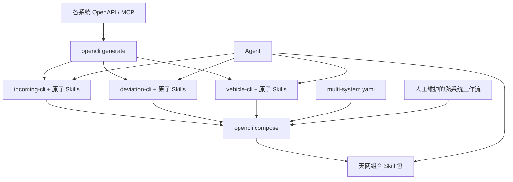
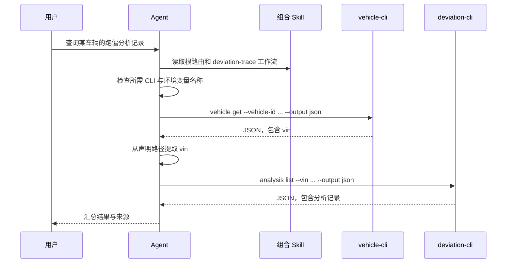

# 多系统 Skills 与独立 CLI 组合设计

## 1. 背景

天网平台作为主系统，通过微应用嵌入来料检验、跑偏分析、车辆档案追溯等子系统。每个系统独立提供 OpenAPI 或 MCP 描述，并由 OpenCLI 生成自己的 CLI 和原子 Skill 包。各 CLI 有独立的服务地址、认证令牌、发布节奏和权限边界。

现有 OpenCLI 可以：

- 从单个 OpenAPI 或 MCP 输入生成一个 CLI；
- 按命令组生成 `skills/<group>/SKILL.md`；
- 当同一 CLI 包含多个命令组时生成项目内的 Skill 路由文件；
- 通过生成 CLI 的 `skills list` 和 `skills read` 读取该项目自身的 Skill。

现有能力不能把多个独立生成项目组合成一个 Agent 可加载的 Skill 包，也没有跨系统注册、独立认证声明、命名隔离和跨 CLI 工作流模型。

## 2. 目标

增加构建期组合能力，使维护者可以把多个独立 CLI 的 Skill 包组合成一个天网平台 Skill 包。Agent 加载一个组合目录后，可以：

1. 根据用户意图选择正确的系统和命令组；
2. 调用多个独立 CLI；
3. 为每个 CLI 使用独立的 `base_url` 和 token；
4. 按声明的工作流把上一步 JSON 输出字段传给下一步；
5. 在执行写入操作前遵守确认和回读验证规则。

组合过程不改变子系统的独立部署关系，也不把多个 CLI 编译成一个二进制。

## 3. 非目标

第一阶段不实现：

- 在线 Skill 注册中心；
- 统一 API 网关或请求代理；
- token 的签发、刷新或集中托管；
- 通用工作流执行引擎；
- 跨系统分布式事务；
- 微应用页面跳转协议；
- 根据 API 描述自动推断真实业务流程。

跨系统工作流由维护者显式编写，第一阶段由 Agent 读取工作流 Skill 后逐条调用 CLI。

## 4. 方案选择

### 4.1 手工复制和汇总

把各系统的 Skill 目录复制到统一目录，再人工编写根 `SKILL.md`。实现成本最低，但无法稳定处理命名冲突、版本漂移、失效引用和重复生成，不作为正式方案。

### 4.2 构建期组合 Skill 包

新增 `opencli compose`，读取多系统组合配置，验证输入 Skill 包，复制并命名隔离原子 Skill，生成根路由、系统路由、组合清单和工作流 Skill。这是推荐方案。

该方案保持 CLI 独立，同时为 Agent 提供一个稳定、可审查、可重复生成的 Skill 加载入口，符合当前项目以生成器和文件制品为核心的结构。

### 4.3 运行时注册中心和统一网关

由在线服务动态发现 Skill、管理凭据并转发请求。该方案适合大量系统和集中治理，但引入新的高可用服务、网络协议和安全责任，超出当前需求。

## 5. 总体架构



系统由三类模块构成：

- **原子生成模块**：现有 `opencli generate`，每次处理一个系统并生成独立 CLI 与原子 Skill。
- **组合模块**：新增 `opencli compose`，以文件为输入和输出，不连接业务系统，也不读取 token 值。
- **Agent 执行环境**：加载组合 Skill，安装并允许执行全部声明的 CLI，通过独立环境变量向 CLI 注入配置和凭据。

组合模块的接口保持收敛：输入一份组合配置、若干 Skill 包和工作流覆盖目录，输出一个完整的组合 Skill 包。输入校验、命名隔离、引用重写和路由生成都隐藏在该模块内部。

## 6. CLI 接口

新增命令：

```bash
opencli compose \
  --config ./multi-system.yaml \
  --output ./dist/sky-skills
```

命令约束：

- `--config` 必填，指向组合配置文件；
- `--output` 必填，指向组合 Skill 输出目录；
- 输出目录已存在时，只更新 OpenCLI 管理的生成文件；
- 输入无效时不留下部分生成结果；
- 命令不要求业务 CLI 已安装，因为构建环境和 Agent 运行环境可能不同；
- 命令验证声明的 Skill 目录和文件结构，但不验证实际业务 endpoint 或 token。

为避免静默覆盖人工内容，生成文件应带有生成标记。工作流源文件保留在配置声明的 `workflows_dir`，组合输出是其可发布副本，不应直接在输出目录内维护唯一版本。

## 7. 组合配置

建议配置格式：

```yaml
version: v1

suite:
  name: sky-platform
  description: 天网平台多系统能力入口

systems:
  - id: incoming
    name: 来料检验
    binary: incoming-cli
    skills_dir: ./generated/incoming/skills
    base_url_env: INCOMING_BASE_URL
    token_env: INCOMING_TOKEN

  - id: deviation
    name: 跑偏分析
    binary: deviation-cli
    skills_dir: ./generated/deviation/skills
    base_url_env: DEVIATION_BASE_URL
    token_env: DEVIATION_TOKEN

  - id: vehicle
    name: 车辆档案追溯
    binary: vehicle-cli
    skills_dir: ./generated/vehicle/skills
    base_url_env: VEHICLE_BASE_URL
    token_env: VEHICLE_TOKEN

workflows_dir: ./workflows
```

### 7.1 配置约束

- `version` 必须是组合器支持的版本；第一版仅接受 `v1`。
- `suite.name` 必须是合法 Skill 名称。
- `systems` 至少包含一个系统。
- `systems[].id`、`systems[].binary` 必须非空且在清单内唯一。
- `base_url_env` 和 `token_env` 必须是合法环境变量名。
- 不同系统的凭据环境变量名必须不同，避免 CLI 之间发生配置串用。
- `skills_dir` 相对于组合配置所在目录解析。
- 每个 `skills_dir` 必须存在，并至少包含一个有效的 `SKILL.md`。
- 配置中只允许出现环境变量名称，不允许出现 token 值。

未来如需无 token、AK/SK 或其他认证方式，可把认证声明扩展为带类型的结构；第一版沿用现有 token 场景，不提前引入凭据提供器抽象。

## 8. 独立运行时配置与认证

现有生成 Skill 和运行时默认使用 `OPENCLI_BASE_URL`、`OPENCLI_AUTH_TOKEN`。当多个 CLI 在同一 Agent 环境中执行时，共用变量名会产生串用风险。

生成配置需要支持显式环境变量名称：

```yaml
runtime:
  base_url_env: INCOMING_BASE_URL
  auth_token_env: INCOMING_TOKEN
```

对应关系为：

| CLI | Base URL 环境变量 | Token 环境变量 |
| --- | --- | --- |
| `incoming-cli` | `INCOMING_BASE_URL` | `INCOMING_TOKEN` |
| `deviation-cli` | `DEVIATION_BASE_URL` | `DEVIATION_TOKEN` |
| `vehicle-cli` | `VEHICLE_BASE_URL` | `VEHICLE_TOKEN` |

设计规则：

- 环境变量名称进入生成的 Skill 和组合清单；
- 环境变量值只由 Agent 的运行环境、Secret 管理系统或部署平台注入；
- Skill、组合配置、日志和生成报告不得包含 token 值；
- 每个 CLI 只读取自身配置的变量；
- 为兼容已有生成配置，未声明新字段时继续使用 `OPENCLI_BASE_URL` 和 `OPENCLI_AUTH_TOKEN`；
- `compose` 对多系统使用相同默认变量名给出错误，要求维护者显式配置独立名称。

## 9. 组合输出契约

建议输出结构：

```text
sky-skills/
├── SKILL.md
├── manifest.yaml
├── README.md
├── systems/
│   ├── incoming/
│   │   ├── SKILL.md
│   │   └── groups/
│   ├── deviation/
│   │   ├── SKILL.md
│   │   └── groups/
│   └── vehicle/
│       ├── SKILL.md
│       └── groups/
└── workflows/
    ├── quality-trace/
    │   └── SKILL.md
    └── deviation-trace/
        └── SKILL.md
```

### 9.1 根 Skill

根 `SKILL.md` 是 Agent 的唯一总入口，包含：

- 套件名称和用途；
- 所需 CLI 二进制列表；
- 系统选择规则；
- 工作流选择规则；
- 认证变量名称及缺失时的处理方式；
- 读取子 Skill 的相对路径；
- 跨系统写入操作的统一安全规则。

根 Skill 不复制所有命令细节，避免随着系统数量增长而失控。

### 9.2 系统路由 Skill

每个 `systems/<id>/SKILL.md` 只负责该系统内部的命令组选择。组合器从输入 Skill 包生成该路由，并将原子 Skill 包复制到系统命名空间下。

输入 Skill 的业务命令示例继续调用原二进制，例如 `vehicle-cli vehicle get`。组合器只重写 Skill 名称、相对文档链接和发现说明，不改写业务命令。

### 9.3 命名隔离

系统 ID 是组合包中的顶层命名空间。即使两个 CLI 都有 `query` 或 `vehicle` 命令组，也分别位于不同系统目录，不发生覆盖。

组合后的 Skill 标识使用 `<suite>-<system>-<group>` 形式，例如：

```text
sky-platform-incoming-inspection
sky-platform-deviation-analysis
sky-platform-vehicle-archive
```

## 10. 组合清单

生成的 `manifest.yaml` 是机器可读的发布清单，不是 Secret 文件。它记录：

```yaml
version: v1
suite: sky-platform
systems:
  incoming:
    binary: incoming-cli
    base_url_env: INCOMING_BASE_URL
    token_env: INCOMING_TOKEN
    skill: systems/incoming/SKILL.md
  deviation:
    binary: deviation-cli
    base_url_env: DEVIATION_BASE_URL
    token_env: DEVIATION_TOKEN
    skill: systems/deviation/SKILL.md
  vehicle:
    binary: vehicle-cli
    base_url_env: VEHICLE_BASE_URL
    token_env: VEHICLE_TOKEN
    skill: systems/vehicle/SKILL.md
```

第一阶段 Agent 主要读取 `SKILL.md`；`manifest.yaml` 用于验证、部署检查和未来工具集成，不要求 Agent 直接执行清单。

## 11. 跨系统工作流

API 描述只能提供单系统命令事实，不能可靠推断跨系统业务含义。因此工作流必须由维护者显式编写，并作为独立 Skill 进入组合包。

工作流 Skill 应至少声明：

- 触发场景；
- 涉及的系统和 CLI；
- 前置查询；
- 每一步命令；
- 上一步输出字段到下一步输入参数的映射；
- 写入确认点；
- 成功后的回读验证；
- 部分失败时的停止和恢复建议。

示例：

```yaml
name: deviation-trace
description: 根据车辆标识查询档案并关联跑偏分析记录

steps:
  - id: get_vehicle
    system: vehicle
    command: vehicle-cli vehicle get
    inputs:
      vehicle_id: ${user.vehicle_id}
    outputs:
      vin: $.data.vin

  - id: list_deviation
    system: deviation
    command: deviation-cli analysis list
    inputs:
      vin: ${get_vehicle.vin}
```

该 YAML 是文档中的结构化示例，不代表第一阶段新增执行 DSL。Agent 仍按照 Skill 的文字规则逐步执行命令。

## 12. CLI 输出约束

可靠联动要求 CLI 提供稳定的机器可读输出。参与组合的命令应支持 JSON 输出，并满足以下约束：

- stdout 只输出业务结果 JSON；
- 诊断和进度信息写入 stderr；
- 成功返回退出码 `0`；
- 参数、认证、权限、远端服务和网络错误使用非零退出码；
- JSON 字段名在兼容版本内保持稳定；
- 工作流引用具体 JSON 路径，不依赖自然语言猜测字段。

第一阶段不强制统一所有系统的业务响应结构，但建议生成 CLI 使用一致的错误 JSON 契约，至少包含 `code`、`message` 和可选 `details`。

## 13. Agent 执行流程



Agent 不应通过拼接不透明 shell 管道完成工作流。每一步单独执行、解析结果、检查退出状态，再决定是否进入下一步，以便准确定位失败系统。

## 14. 错误处理

### 14.1 组合期错误

以下情况使 `opencli compose` 失败并返回非零退出码：

- 配置版本不受支持；
- 系统 ID 或二进制名称重复；
- 多系统复用了相同的认证环境变量；
- Skill 目录不存在或缺少入口文件；
- Skill frontmatter 无效；
- 复制后 Skill 名称或目标路径冲突；
- 工作流引用不存在的系统；
- 输出文件引用无法解析。

组合器先在临时目录完成全部验证和渲染，成功后再发布到目标目录，避免产生半成品。

### 14.2 Agent 运行期错误

- 缺少 CLI：停止执行并指出缺失的二进制名称。
- 缺少环境变量：停止调用对应系统，只报告变量名称，不输出其他 Secret。
- 认证失败：停止该工作流，不尝试把其他系统的 token 用于当前 CLI。
- 查询无结果：按工作流定义结束或请求用户补充标识，不猜测 ID。
- 中间步骤失败：不执行依赖其输出的后续步骤。
- 写入后验证失败：明确区分“写入调用成功”和“回读未确认”，不得直接宣称整体成功。
- 部分写入失败：不自动补偿，展示已成功步骤、失败步骤和人工恢复建议。

## 15. 版本与更新策略

- 组合配置和生成清单都有独立的 `version`。
- 每个被组合的系统在清单中记录输入 Skill 包的版本和内容摘要。
- 子系统重新生成 Skill 后必须重新执行 `opencli compose`。
- 组合器输出按稳定的系统 ID 和命令组 ID 定位，展示名称变化不应改变路径。
- 删除系统、命令组或工作流属于显式配置变更，组合器应在摘要中报告删除项。
- 组合输出是构建制品，不作为人工编辑的唯一来源。

## 16. 当前仓库的改造位置

### 16.1 配置模型

在 `internal/configgen` 的 `RuntimeConfig` 增加：

```go
BaseURLEnv   string `yaml:"base_url_env"`
AuthTokenEnv string `yaml:"auth_token_env"`
```

规划阶段把规范化后的变量名称写入 `model.App` 或专门的运行时配置模型。未配置时保持当前默认值，以兼容现有项目。

### 16.2 生成运行时和模板

更新 Go、Rust 生成运行时与 Skill 模板，使其读取和展示配置后的环境变量名称，不再在模板中假定所有 CLI 都使用同一组 `OPENCLI_*` 变量。

### 16.3 组合模块

新增 `internal/compose`。其外部接口只接收配置路径和输出路径，内部负责：

1. 加载并验证配置；
2. 读取输入 Skill 包；
3. 建立系统命名空间；
4. 重写 Skill frontmatter 和相对引用；
5. 合并工作流覆盖文件；
6. 生成根路由、系统路由、README 和清单；
7. 原子发布输出目录。

该模块不依赖 Cobra，不连接远端系统，也不管理 Secret。命令层只负责把 CLI 参数交给组合模块并呈现错误。

### 16.4 命令接入

在 `internal/app` 增加 `compose` 命令，并接入根命令。组合配置与单系统 `opencli.yaml` 用途不同，使用独立加载模型，避免继续扩大现有 `configgen.Config` 的职责。

### 16.5 模板

在 `internal/render/templates` 增加组合专用模板：

- 根 `SKILL.md`；
- 系统路由 `SKILL.md`；
- 组合 `README.md`；
- `manifest.yaml`。

组合渲染可以复用底层模板读取和写文件能力，但不应把多系统概念塞入现有单系统 `model.App`。

## 17. 测试策略

### 17.1 单元测试

- 组合配置解析和默认值；
- 非法版本、重复系统 ID、重复二进制和重复环境变量；
- 相对路径解析；
- Skill frontmatter 读取；
- 系统命名空间和 Skill 名称生成；
- 相对链接重写；
- 工作流系统引用验证；
- token 值泄漏扫描；
- 原子输出行为。

### 17.2 命令测试

- `opencli compose --help`；
- 缺少必填参数；
- 成功生成组合包；
- 输入无效时退出码和错误信息；
- 已存在输出目录时的安全更新行为。

### 17.3 集成测试

测试夹具生成三个最小 CLI 和 Skill 包，然后组合为一个天网 Skill 包，验证：

- 根 Skill 声明三个二进制；
- 三个系统 Skill 均可被发现；
- 同名命令组不会覆盖；
- 各 Skill 展示正确的独立环境变量；
- 工作流相对引用有效；
- 生成内容不包含测试 token 值；
- Agent 验证器能加载一个组合目录并依次调用两个不同 CLI 的只读命令。

### 17.4 回归测试

现有单系统生成、Go/Rust 目标、OpenAPI/MCP 输入和 `skills list/read` 行为必须保持不变。未配置独立环境变量名称的旧配置继续生成使用 `OPENCLI_BASE_URL`、`OPENCLI_AUTH_TOKEN` 的 CLI。

## 18. 实施阶段划分

建议拆成三个可独立验证的阶段：

1. **独立运行时配置**：支持每个 CLI 自定义 Base URL 和 token 环境变量名称，并覆盖 Go、Rust 和生成 Skill。
2. **组合 Skill 生成**：实现组合配置、`opencli compose`、命名隔离、路由和清单。
3. **跨系统工作流与 Agent 验证**：定义工作流包格式，扩展 `skills-verify` 验证多 CLI 顺序调用。

每个阶段完成后都保持仓库可测试、可发布，不依赖尚未实现的在线基础设施。

## 19. 验收标准

满足以下条件即认为第一版完成：

- 三个独立生成的 CLI 可以使用三套不同的 Base URL 和 token 环境变量；
- `opencli compose` 可以把三个 CLI 的 Skill 包生成一个天网组合 Skill 包；
- Agent 只需加载组合目录即可发现系统 Skill 和工作流 Skill；
- 两个系统存在同名命令组时不会冲突；
- 一个只读跨系统工作流可以把第一个 CLI 的 JSON 字段传给第二个 CLI；
- 缺少 CLI、环境变量或中间输出字段时，Agent 停止后续步骤并给出明确错误；
- 所有生成文件和日志都不包含 token 值；
- 现有单系统生成行为和测试继续通过。
