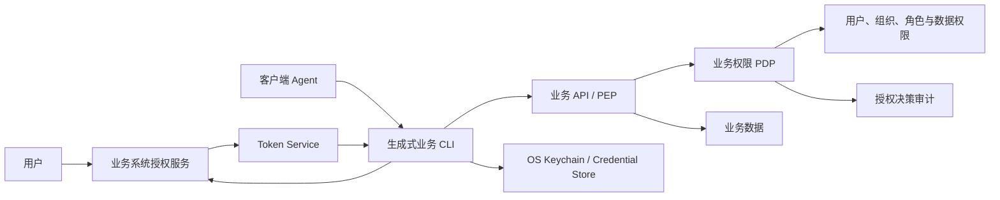
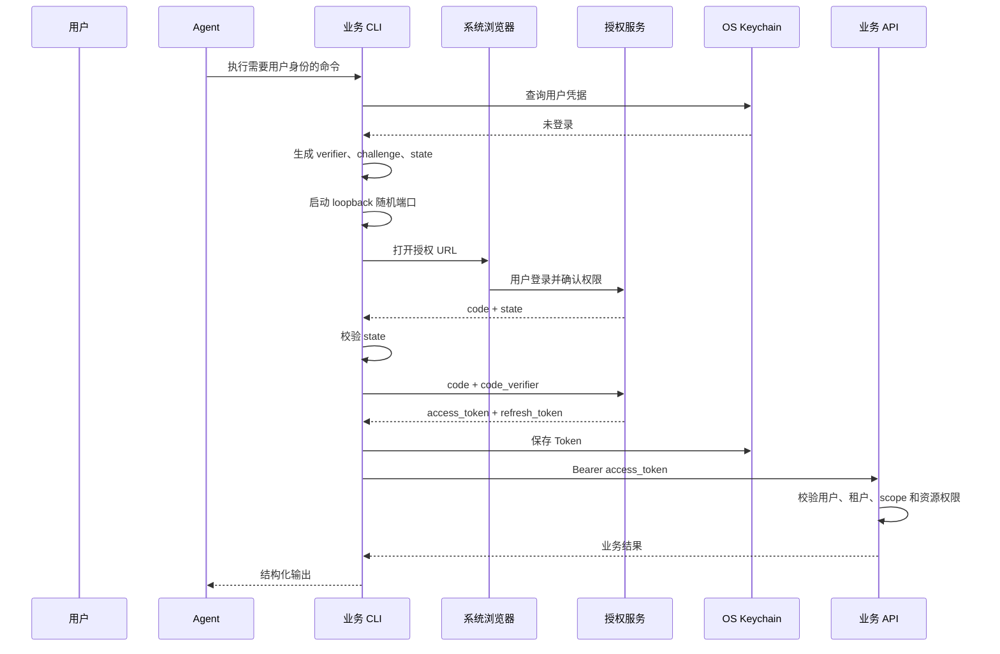

# 企业业务系统 AI Native 认证授权架构与开发规范

> 修订说明（2026-07-31）：当前版本收敛为“终端电脑上的 Agent 代表当前用户访问个人数据”。服务器 Agent 用户授权、Device Flow、应用权限和工作负载身份不属于本期范围，后续单独设计。

> 独立对接指南：[one-cli 用户授权对接与本地验证指南](../../design/oidc-cli-business-integration.md)。

> 实施状态（2026-08-04）：one-cli 已通过 `--auth oauth2` + `grant_type: authorization_code` 支持可选 PKCE S256 和可选 OIDC 校验，Go/Rust 均生成顶层 `login`、`status`、`logout`。当前没有独立的 `--auth oidc`、`--auth oauth2-pkce`，也没有 Keychain、`auth check`、`identity current` 或远程 revoke；本文中这些内容仍是后续目标契约。当前准确用法以 [用户授权对接指南](../../design/oidc-cli-business-integration.md) 为准。

## 1. 文档摘要

本方案指导企业内部业务系统把个人数据 API 改造成可安全提供给终端电脑上的 AI Agent 和生成式 CLI 使用的 AI Native API。

本方案采用“分布式业务授权、统一协议与客户端契约”的架构：

- 不新增统一代理所有业务请求的鉴权网关；
- 不提供可以调用所有企业系统的万能 Token；
- 每个业务系统独立签发仅面向本系统的短期 Token；
- 每个业务系统负责用户、租户、资源和操作级最终授权；
- OpenCLI 统一登录命令、Token 存储、错误格式和 OpenAPI 扩展；
- 个人数据使用 OIDC/OAuth 2.0 Authorization Code + PKCE；
- CLI 在终端电脑上临时监听 loopback 回调，Token 存入 OS Keychain；
- CLI 不接收账号密码，也不内置 `client_secret`。

核心原则是：

> CLI 是 Agent 的能力接口，不是最终安全边界；Token 证明主体与委托，业务系统根据可信主体决定可访问的数据和可执行的操作。

## 2. 背景与问题

传统 API 常见以下认证方式：

- 固定 Bearer Token；
- OAuth 2.0 Client Credentials；
- AK/SK 请求签名；
- API Key；
- 自定义认证 Header；
- 由调用方传入员工号、用户 ID 或租户 ID。

这些方式主要解决“哪个应用或凭据发起请求”，通常不能完整回答：

1. 哪个 Agent 实例发起了请求；
2. Agent 是否代表某个用户；
3. 用户具体同意了哪些权限；
4. 当前用户是否可以访问目标资源；
5. 高风险写操作是否获得了本次明确确认；
6. 凭据泄漏后能否只撤销单个 Agent 或单个授权会话。

把传统凭据直接编译进可下载 CLI 会产生以下问题：

- 二进制中的 `client_secret`、AK/SK 或 API Key 可以被提取或直接滥用；
- 多个 Agent 共享凭据，无法独立撤销和审计；
- 应用身份可能被错误用于读取个人数据；
- 仅隐藏 `userId` 参数不能阻止绕过 CLI 直接调用 API；
- 模型幻觉、提示注入和工具参数污染会扩大越权风险。

## 3. 第一性原则

### 3.1 认证、授权和委托是三件事

- 认证：确认调用主体是谁；
- 授权：判断该主体能否执行当前操作；
- 委托：确认 Agent 是否被允许代表某个用户执行操作。

完成登录不等于获得所有业务权限，持有有效 Token 也不等于可以访问任意资源。

### 3.2 当前调用包含两个上下文

```text
工具调用方：终端电脑上的 Agent
授权主体：当前登录用户
```

本期所有受保护业务请求都必须具有用户主体。Agent 只能表达操作意图，不能自行指定用户、租户、角色或 Token。

### 3.3 Public Client 不能保守共享秘密

分发到员工电脑、npm 包或安装包中的 CLI 属于 Public Client。

- `client_id` 可以公开并内置；
- 共享 `client_secret` 不能作为可信安全边界；
- 用户授权必须使用 Authorization Code + PKCE；
- 用户账号密码、MFA 和 SSO 只在业务系统授权页面中处理。

### 3.4 Token 必须限定使用范围

Token 至少需要限制：

- 签发者；
- 目标系统；
- 主体；
- 客户端；
- 租户；
- scope；
- 有效期。

一个业务系统签发的 Token 不得被另一个业务系统接受。

### 3.5 最终授权必须在服务端执行

CLI 隐藏参数、Skill 约束和 Agent 提示属于减少误操作面的措施，不是可靠授权边界。

业务系统必须根据 Token 中的可信主体执行：

- 当前用户解析；
- 租户隔离；
- 资源所有权校验；
- 部门或组织数据范围校验；
- 操作级权限判断；
- 高风险确认校验。

## 4. 建设目标

### 4.1 目标

- 支持终端电脑上的 Agent 以当前用户身份访问本人或获授权范围内的数据；
- 不要求存在统一业务请求网关；
- 不要求所有业务系统使用同一个 Token；
- 为不同业务系统提供一致的认证授权开发规范；
- 为 OpenCLI 提供可自动生成的认证和授权元数据；
- 支持单用户、单客户端、单租户和单授权会话独立撤销；
- 对 AI 调用提供结构化错误、确认、审计和恢复指引；
- 兼容存量个人 Bearer Token 接口的迁移。

### 4.2 非目标

第一阶段不实现：

- 服务器 Agent 代表个人用户调用业务 API；
- Device Authorization Flow；
- 服务器回调服务和用户 Token Vault；
- 应用权限和工作负载身份；
- OAuth Client Credentials、AK/SK、API Key 的应用级改造；
- 一个 Token 调用所有企业系统；
- 统一代理所有业务流量；
- 由 CLI 代替业务系统做最终授权；
- 自动推断未在接口文档中声明的业务权限；
- 将共享 Secret 加密后编译进 CLI 并视为安全存储；
- 用自然语言提示代替服务端权限校验；
- 跨业务系统分布式事务。

## 5. 术语

| 术语 | 含义 |
| --- | --- |
| Agent | 使用 CLI 调用业务能力的 AI Agent 或自动化执行器 |
| CLI Client | 由 OpenCLI 生成的业务系统客户端 |
| Public Client | 无法可靠保存共享 Secret 的客户端 |
| Authorization Server | 完成用户授权并签发 Token 的服务 |
| Resource Server | 接受 Token 并提供业务 API 的服务 |
| User Delegation | Agent 获准代表某个用户执行限定操作 |
| Access Token | 调用业务 API 的短期凭证 |
| Refresh Token | 用于刷新 Access Token 的长期凭证 |
| PKCE | 将 Authorization Code 绑定到发起登录的客户端实例 |
| Scope | Token 获准调用的能力范围 |
| Audience | Token 允许访问的目标业务系统 |
| PEP | 业务 API 中执行策略的授权检查点 |
| PDP | 根据主体、资源和上下文做授权决策的模块 |

## 6. 总体架构



### 6.1 无网关架构的统一边界

本方案统一：

- OAuth/OIDC 协议；
- Agent 与用户身份模型；
- Token Claims；
- scope 命名；
- CLI 命令；
- OpenAPI 扩展；
- 错误契约；
- 测试和验收标准。

本方案不统一：

- Token 真值；
- Token audience；
- 业务权限数据；
- 业务系统授权决策；
- 用户在各业务系统中的资源范围。

### 6.2 业务系统部署选择

业务系统可以选择：

1. 接入已有企业身份平台，由身份平台签发本系统 audience 的 Token；
2. 在本系统部署独立授权服务；
3. 使用共享认证授权 SDK 或标准身份产品部署本系统授权能力。

即使没有统一登录，也必须遵守同一协议和开发规范。不得由各团队自行设计不兼容的密码登录和 Token 格式。

## 7. 信任边界与用户身份模型

### 7.1 用户委托身份

适用于：

- 查询本人考勤；
- 查询本人审批；
- 读取本人文档；
- 提交本人申请；
- 使用用户已有数据权限进行查询。

用户授权上下文包含：

```json
{
  "client": {
    "client_id": "finance-cli"
  },
  "actor": {
    "type": "user",
    "subject": "user-10086"
  },
  "delegation": {
    "tenant_id": "company-a",
    "scopes": ["expense:read:self"],
    "expires_at": "2026-07-29T18:00:00+08:00"
  }
}
```

### 7.2 可信边界

可信信息来自授权服务器签发的 Token，包括用户主体、客户端、租户、scope 和 audience。

Agent 传入的 `userId`、员工号、租户 Header、角色和 Token 均不可信。CLI 隐藏这些参数只能减少误操作，业务 API 仍必须服务端校验。

## 8. 用户授权：Authorization Code + PKCE

### 8.1 适用范围

Authorization Code + PKCE 是本地桌面 CLI 访问个人数据的默认流程。

如果业务系统还需要完成用户登录和身份确认，应使用 OIDC，在 scope 中包含 `openid`。

### 8.2 时序



### 8.3 PKCE 要求

CLI 必须：

- 使用密码学安全随机源生成 `code_verifier`；
- `code_verifier` 长度为 43～128 个 URL-safe 字符；
- 使用 `S256` 计算 `code_challenge`；
- 每次授权生成新的 `state`；
- 只使用系统外部浏览器；
- 只监听 `127.0.0.1` 或 `::1`；
- 使用随机端口和固定回调路径；
- 完成回调后立即关闭监听器。

授权服务必须：

- 强制 `code_challenge_method=S256`；
- 禁止 `plain`；
- Authorization Code 一次性使用；
- Code 建议 2 分钟内过期；
- Code 绑定 `client_id`、`redirect_uri`、scope 和 PKCE challenge；
- Token Endpoint 不要求 Public Client 提供 `client_secret`。

### 8.4 授权请求

```http
GET /oauth/authorize
  ?response_type=code
  &client_id=finance-cli
  &redirect_uri=http://127.0.0.1:49152/oauth/callback
  &scope=openid%20profile%20expense:read:self
  &state=random-state
  &code_challenge=pkce-challenge
  &code_challenge_method=S256
```

授权页面必须展示：

- 业务系统名称；
- CLI/Agent 名称；
- 用户身份；
- 申请的具体权限；
- 数据范围；
- 授权有效期；
- 高风险权限提示。

### 8.5 Token 请求

```http
POST /oauth/token
Content-Type: application/x-www-form-urlencoded

grant_type=authorization_code&
client_id=finance-cli&
code=one-time-code&
redirect_uri=http://127.0.0.1:49152/oauth/callback&
code_verifier=original-verifier
```

成功响应：

```json
{
  "access_token": "short-lived-token",
  "token_type": "Bearer",
  "expires_in": 900,
  "refresh_token": "opaque-refresh-token",
  "scope": "openid profile expense:read:self",
  "id_token": "oidc-id-token"
}
```

### 8.6 服务器 Agent

服务器 Agent 用户授权不属于本期范围。CLI 不为服务器 Agent 启动用户回调服务，也不在服务器保存个人 Refresh Token。

如果未来确有需求，应针对可信 Agent Runtime、多用户隔离和凭据托管单独设计，不复用终端用户授权实现。

## 9. 后续独立议题

以下能力与本期用户授权隔离，不能作为认证失败后的自动降级路径：

- 服务器 Agent；
- 应用权限；
- 工作负载身份；
- Client Credentials；
- `private_key_jwt`、mTLS；
- AK/SK 和 API Key；
- Device Authorization Flow。

## 10. 授权服务接口规范

新系统优先提供标准 OIDC：

| 接口 | 必选 | 说明 |
| --- | --- | --- |
| `GET /.well-known/openid-configuration` | 推荐 | OIDC 元数据发现；新系统应提供 |
| `GET /oauth/authorize` | 是 | 浏览器登录与授权 |
| `POST /oauth/token` | 是 | Code 和 Refresh Token 换取 |
| `GET /oauth/jwks` | 是 | ID Token 验签公钥 |
| `POST /oauth/revoke` | 建议 | 登出与撤销 |
| `GET /oauth/userinfo` | 条件必选 | ID Token 不含业务所需 tenant 时完成主体映射 |
| `GET /api/v1/me` | 条件必选 | 可代替 UserInfo 完成业务主体映射 |

OIDC 不提供 Discovery 时，仍必须有稳定 issuer、ID Token、JWKS、authorize 和 token endpoint，并在 CLI Runtime Config 中显式配置端点。

存量系统只有 OAuth2 Authorization Code 时，至少提供 authorize、token 和 `/me` 等 Identity Endpoint，并使用 `oauth2_pkce`。Revocation 建议提供。

opaque Access Token 的验证由 Resource Server 通过 Introspection Endpoint 或授权服务提供的等价机制完成。

身份接口统一返回稳定 `sub`、按需返回 `tenant_id`，可返回展示用 `name`。OIDC 返回的 `sub` 必须与验签后的 ID Token `sub` 一致；tenant-bound operation 缺少可信 tenant 时登录失败。

### 10.1 元数据示例

```json
{
  "issuer": "https://finance.example.com",
  "authorization_endpoint": "https://finance.example.com/oauth/authorize",
  "token_endpoint": "https://finance.example.com/oauth/token",
  "revocation_endpoint": "https://finance.example.com/oauth/revoke",
  "jwks_uri": "https://finance.example.com/oauth/jwks",
  "scopes_supported": [
    "openid",
    "profile",
    "expense:read:self",
    "expense:submit:self"
  ],
  "response_types_supported": ["code"],
  "grant_types_supported": ["authorization_code", "refresh_token"],
  "code_challenge_methods_supported": ["S256"]
}
```

### 10.2 Public CLI Client 注册

```yaml
client_id: finance-cli
client_type: public
grant_types:
  - authorization_code
  - refresh_token
redirect:
  type: loopback
  path: /oauth/callback
pkce:
  required: true
  methods: [S256]
allowed_scopes:
  - openid
  - profile
  - expense:read:self
  - expense:submit:self
```

## 11. Token 规范

### 11.1 Access Token

推荐使用短期签名 JWT：

- 有效期建议 5～15 分钟；
- 使用非对称签名；
- 通过 JWKS 发布公钥；
- 支持 `kid` 和密钥轮换；
- 不在 Token 中写入敏感业务数据；
- API 必须校验签名、`iss`、`aud`、`exp` 和 scope。

示例 Claims：

```json
{
  "iss": "https://finance.example.com",
  "sub": "user-10086",
  "aud": "finance-api",
  "azp": "finance-cli",
  "tenant_id": "company-a",
  "scope": "expense:read:self",
  "auth_time": 1785310000,
  "iat": 1785310100,
  "exp": 1785311000,
  "jti": "token-uuid"
}
```

### 11.2 Refresh Token

Refresh Token 应为不可预测的 opaque 值：

- 只保存摘要或加密值；
- 每次刷新必须轮换；
- 旧 Token 立即失效；
- 检测旧 Token 复用；
- 复用时撤销整个授权会话；
- scope 不得在刷新时扩大；
- 用户禁用、离职或撤权后不得继续刷新。

### 11.3 Audience 隔离

```text
attendance-api Token 只能访问 attendance-api
finance-api Token 只能访问 finance-api
bpm-api Token 只能访问 bpm-api
```

业务系统不得接受：

- `aud` 缺失的 Token；
- audience 为其他系统的 Token；
- 通用 `aud=enterprise-all` Token。

## 12. 权限模型

### 12.1 Scope 命名

建议格式：

```text
<resource>:<action>:<data-range>
```

示例：

```text
expense:read:self
expense:read:department
expense:read:any
expense:submit:self
payment:approve:assigned
report:read:company
```

### 12.2 授权决策

```text
allow =
  token_valid
  AND audience_matches
  AND client_active
  AND agent_active
  AND scope_allows_operation
  AND tenant_matches
  AND resource_policy_allows_subject
  AND data_classification_allows_agent
  AND confirmation_policy_satisfied
```

### 12.3 资源级授权

`expense:read:self` 只允许读取 `owner_id == token.sub` 的资源。

`expense:read:department` 需要根据当前用户的组织关系计算部门范围。

`expense:read:any` 仍然受租户、数据分类和业务角色限制。

业务系统不得只验证 scope 后直接按调用方传入的资源 ID 返回数据。

## 13. 业务 API 设计规范

### 13.1 个人数据接口

优先：

```http
GET /api/v1/me/expenses
GET /api/v1/me/tasks
POST /api/v1/me/leave-requests
```

避免：

```http
GET /api/v1/expenses?employeeId=任意工号
```

兼容旧接口时：

- 服务端根据 `token.sub` 推导当前员工；
- 普通用户传入其他员工 ID 时返回 403；
- 允许跨用户查询的管理员必须持有更高数据范围 scope；
- 不允许 CLI 端的参数隐藏代替服务端校验。

### 13.2 身份参数

以下字段不能被普通调用方声明为可信身份：

- `userId`；
- `employeeId`；
- `tenantId`；
- `departmentId`；
- `agentId`；
- `role`。

服务端必须从可信 Token、用户目录或 Agent 注册信息中派生。

### 13.3 写操作

写操作必须：

- 支持幂等键；
- 明确资源版本或并发控制；
- 返回结构化变更结果；
- 对高风险操作要求确认；
- 执行后支持回读验证；
- 写入审计记录。

### 13.4 高风险操作

风险分级：

```text
read
write
high-risk-write
```

以下操作默认属于 `high-risk-write`：

- 删除；
- 审批；
- 支付；
- 权限变更；
- 批量操作；
- 不可逆状态变更；
- 导出大量敏感数据。

高风险操作不能因用户已经登录而自动执行。确认授权必须绑定：

- 用户；
- Agent；
- operation；
- resource；
- 请求参数摘要；
- 有效期；
- 一次性 nonce。

## 14. OpenAPI 开发规范

### 14.1 Security Scheme

```yaml
components:
  securitySchemes:
    userOAuth:
      type: oauth2
      flows:
        authorizationCode:
          authorizationUrl: https://finance.example.com/oauth/authorize
          tokenUrl: https://finance.example.com/oauth/token
          scopes:
            expense:read:self: 查看本人费用记录
            expense:submit:self: 提交本人报销
```

### 14.2 AI 授权扩展

每个业务 operation 应声明 `x-ai-access`：

```yaml
paths:
  /api/v1/me/expenses:
    get:
      operationId: listMyExpenses
      security:
        - userOAuth:
            - expense:read:self
      x-ai-access:
        subject_modes:
          - user
        audience: finance-api
        scopes:
          - expense:read:self
        tenant_bound: true
        resource_type: expense
        data_classification: personal
        risk: read
        confirmation: never
```

高风险操作：

```yaml
x-ai-access:
  subject_modes:
    - user
  audience: finance-api
  scopes:
    - payment:approve:assigned
  tenant_bound: true
  resource_type: payment
  data_classification: confidential
  risk: high-risk-write
  confirmation: always
  idempotency_required: true
```

### 14.3 必填字段

`x-ai-access` 必须明确：

- `subject_modes`；
- `audience`；
- `scopes`；
- `tenant_bound`；
- `data_classification`；
- `risk`；
- `confirmation`。

写操作还必须明确：

- `idempotency_required`；
- 是否支持回读；
- 是否可恢复。

## 15. 生成 CLI 契约

所有业务 CLI 统一提供：

```bash
business-cli auth login
business-cli auth status
business-cli auth check --operation <operation>
business-cli auth logout
business-cli identity current
```

业务命令：

```bash
business-cli expense list --as user
business-cli payment approve --as user --id PAY-001 --dry-run
```

### 15.1 身份选择

- 本期受保护 operation 只允许 `user` 主体；
- `--as user` 可以保留为显式说明，也可由 operation 唯一确定；
- CLI 不允许选择任意用户 Profile；
- 用户认证失败后不得改用应用凭据或静态 Token。

### 15.2 Token 存储

Token 按以下维度隔离：

```text
provider identity × client_id × tenant-or-empty × subject
```

OIDC 的 provider identity 是 issuer；OAuth2 PKCE 使用显式 `provider_id`。只有非租户绑定接口允许 tenant 为空，两种会话不得共用存储键。

存储优先级：

1. OS Keychain / Credential Manager；
2. 禁止普通 YAML、命令行参数和生成二进制。

### 15.3 输出规范

- stdout 只输出结构化业务结果；
- stderr 输出进度和恢复提示；
- 不输出 Access Token、Refresh Token、Authorization Header；
- 日志对 Cookie、Secret、签名和敏感参数脱敏；
- `auth status` 只输出身份、scope、状态和过期时间。

### 15.4 CLI 认证配置

新系统使用标准 OIDC，优先只配置 `issuer`。CLI 通过 `/.well-known/openid-configuration` 发现授权服务发布的端点：

```yaml
base_url: https://finance-api.example.com

auth:
  type: oidc
  issuer: https://finance-auth.example.com
  client_id: finance-cli
  audience: finance-api
  scopes:
    - openid
    - profile
    - expense:read:self
  redirect:
    type: loopback
    path: /oauth/callback
  token_store: os_keychain
```

如果业务仍是 OIDC，但暂不支持 Discovery，必须保留稳定 issuer，并显式配置公开的：

- `authorization_endpoint`；
- `token_endpoint`；
- `jwks_uri`。
- 可选的 `revocation_endpoint` 和 `userinfo_endpoint`。

业务只有 OAuth2 Authorization Code、没有 Discovery 和 ID Token 时，不得声明为 `oidc`。使用独立的 `oauth2_pkce` 类型：

```yaml
auth:
  type: oauth2_pkce
  provider_id: finance-auth
  client_id: finance-cli
  audience: finance-api
  authorization_endpoint: https://finance.example.com/oauth/authorize
  token_endpoint: https://finance.example.com/oauth/token
  revocation_endpoint: https://finance.example.com/oauth/revoke
  identity_endpoint: https://finance-api.example.com/api/v1/me
  scopes: [profile, expense:read:self]
```

`authorization_endpoint`、`token_endpoint` 和 `identity_endpoint` 必选。Revocation 建议提供。

`oauth2_pkce` 不校验 OIDC ID Token。Resource Server 仍必须验证 Access Token，并根据 `sub`、tenant 和 scope 做数据授权。

配置不得包含用户名、密码、`client_secret`、Access Token 或 Refresh Token。

## 16. 错误契约

业务 API 和 CLI 使用统一错误结构：

```json
{
  "error": {
    "type": "authorization",
    "subtype": "insufficient_scope",
    "message": "当前授权不能读取部门费用记录",
    "required_scopes": ["expense:read:department"],
    "request_id": "req-uuid",
    "retryable": false,
    "hint": "重新授权所需权限，或改为查询本人数据"
  }
}
```

标准错误类型：

| type | subtype | HTTP | 含义 |
| --- | --- | --- | --- |
| `authentication` | `login_required` | 401 | 未登录 |
| `authentication` | `token_expired` | 401 | Access Token 过期 |
| `authentication` | `invalid_token` | 401 | Token 无效 |
| `authorization` | `insufficient_scope` | 403 | scope 不足 |
| `authorization` | `resource_forbidden` | 403 | 资源级权限不足 |
| `authorization` | `tenant_mismatch` | 403 | 租户不匹配 |
| `authorization` | `agent_disabled` | 403 | Agent 已停用 |
| `consent` | `consent_required` | 403 | 需要重新授权 |
| `confirmation` | `confirmation_required` | 409 | 高风险确认 |
| `validation` | `identity_parameter_forbidden` | 400 | 禁止覆盖身份字段 |

错误响应不得包含 Token、用户敏感信息或服务端策略细节。

## 17. 安全开发红线

业务系统和 CLI 必须遵守：

1. 不将共享 `client_secret`、AK/SK 或 API Key 编译进可下载 CLI；
2. 不在 URL Query 中传输 Secret；
3. 不在日志中记录 Token、Authorization Header 或 Refresh Token；
4. 不使用 Implicit Grant；
5. 不使用 Resource Owner Password Grant；
6. Public Client 不依赖 `client_secret`；
7. PKCE 只允许 `S256`；
8. 不使用嵌入式 WebView 收集用户密码；
9. 不因处于企业内网而跳过 Token 和资源权限校验；
10. 不接受其他业务系统 audience 的 Token；
11. 不信任调用方传入的用户、租户、角色和 Agent 身份；
12. 不把 Skill 或 Agent 提示当成授权控制；
13. 不在用户认证失败后自动切换为高权限应用身份；
14. 不允许 Refresh Token 静默扩大 scope；
15. 不以“加密后与解密密钥一起分发”作为 Secret 安全方案。

## 18. 审计规范

每次业务调用至少记录：

```json
{
  "timestamp": "2026-07-29T10:00:00+08:00",
  "request_id": "req-uuid",
  "issuer": "https://finance.example.com",
  "subject": "user-10086",
  "client_id": "finance-cli",
  "tenant_id": "company-a",
  "operation": "expense.list",
  "resource_type": "expense",
  "resource_id": null,
  "risk": "read",
  "decision": "allow",
  "policy_id": "expense-read-self-v2",
  "result": "success",
  "duration_ms": 82
}
```

审计日志不得记录：

- Token；
- Refresh Token；
- Client Secret；
- 私钥；
- 完整个人数据；
- 敏感请求 Body。

高风险操作还需记录：

- 用户确认 ID；
- 确认时间；
- 请求参数摘要；
- 写入结果；
- 回读验证结果。

## 19. 传统接口兼容

| 现有方式 | 过渡处理 | 目标处理 |
| --- | --- | --- |
| 固定个人 Token | Keychain 保存、短期使用 | Authorization Code + PKCE |
| 任意 employeeId | CLI 隐藏并服务端覆盖 | `/me` 资源接口 |
| 自定义用户认证 Header | 短期兼容 | 标准 Bearer Token |

兼容阶段仍必须满足：

- 每个用户独立凭据；
- 可撤销；
- 可轮换；
- 可审计；
- 资源级授权；
- Secret 不进入分发包。

应用级 OAuth Client Credentials、AK/SK 和 API Key 不在本期迁移范围。

## 20. 共享开发资产

为了避免每个业务团队重复实现不一致的 OAuth 和权限逻辑，应建设共享开发资产，但不部署统一业务网关：

- 授权服务参考实现或 Starter；
- JWT 验签和 Claims 校验中间件；
- 用户主体解析接口；
- scope 和数据范围授权 SDK；
- 审计 SDK；
- OpenAPI `x-ai-access` Linter；
- OAuth/PKCE 协议一致性测试；
- OpenCLI 认证 Provider；
- 安全配置基线；
- 示例业务系统。

共享 SDK 可以统一实现协议，但最终策略和业务数据权限仍由各系统配置和执行。

## 21. 测试规范

### 21.1 协议测试

- PKCE S256 成功；
- 缺少 PKCE 被拒绝；
- `plain` 被拒绝；
- Authorization Code 重放被拒绝；
- `state` 不匹配被 CLI 拒绝；
- redirect URI 不匹配被拒绝；
- Code 过期被拒绝；
- Public Client 无 `client_secret` 仍可完成授权；
- Refresh Token 轮换成功；
- 旧 Refresh Token 复用触发会话撤销；
- revoke 后不能继续刷新。

### 21.2 Token 测试

- 签名错误；
- `iss` 错误；
- `aud` 错误；
- Token 过期；
- scope 缺失；
- 租户不匹配；
- Client 被停用；
- 密钥轮换期间新旧 `kid` 行为正确。

### 21.3 越权测试

- 普通用户读取他人数据返回 403；
- 修改 query 中的 `employeeId` 不能越权；
- 修改 Body 中的 `userId` 不能越权；
- 修改 Header 中的 `tenantId` 不能跨租户；
- 直接绕过 CLI 调用 API 仍不能越权；
- 用户认证失败后不能自动使用应用凭据。

### 21.4 AI Agent 测试

- Token 不出现在 stdout、stderr 和模型上下文；
- 缺少权限时返回可解析的 `required_scopes`；
- 认证失败不自动切换身份；
- 高风险操作必须先 dry-run 和确认；
- 提示注入不能修改身份、租户或授权 Header；
- Skill 中不包含真实 Secret；
- Agent 只能调用 OpenAPI 声明为 `user` 主体的受保护 operation。

## 22. 分阶段实施

### 阶段一：个人数据最小闭环

- 业务系统提供 OIDC/OAuth Authorization Code + PKCE；
- 注册 Public CLI Client；
- 提供 `auth login/status/logout`；
- Token 保存到 Keychain；
- 个人数据接口使用 `/me` 或服务端主体覆盖；
- 完成 `self` 数据范围授权；
- 接入审计。

### 阶段二：OpenCLI 标准化

当前状态：待实施。根目录 `oauth2/` 已提供联调授权服务和个人数据 API，但生成器尚不接受 `--auth oidc` 或 `--auth oauth2-pkce`。

- 解析 authorizationCode Security Scheme；
- 生成 Authorization Code + PKCE 客户端；
- 增加 `x-ai-access`；
- 生成用户身份前置检查；
- 统一结构化错误；
- 增加 OpenAPI Linter 和协议测试。

### 阶段三：高风险治理

- operation 风险分级；
- 一次性确认授权；
- 幂等和回读验证；
- 风险审计和告警；
- 批量与不可逆操作治理。

### 阶段四：存量用户认证收敛

- 固定 Token 迁移为短期 Token；
- 任意用户参数迁移为主体派生；
- 删除分发包中的个人静态 Token；
- 统一安全基线。

## 23. 团队职责

| 团队 | 职责 |
| --- | --- |
| 业务系统团队 | 资源级授权、接口改造、scope、审计、风险分级 |
| 身份平台/授权服务团队 | 用户认证、授权页、Token、撤销、密钥轮换 |
| OpenCLI 团队 | 登录客户端、Provider、Keychain、OpenAPI 生成、错误契约 |
| Agent Runtime 团队 | 工具 allowlist、确认交互、禁止读取或输出 Token |
| 安全团队 | 协议基线、威胁模型、渗透测试、审计规则 |
| 测试团队 | 协议、越权、跨租户、Agent 提示注入测试 |

## 24. 验收标准

业务系统达到 AI Native 认证授权标准必须满足：

- 可以使用 Authorization Code + PKCE 完成用户授权；
- Public CLI Client 不需要 `client_secret`；
- 用户授权仅在终端电脑和本机 loopback 场景启用；
- Access Token 仅对当前业务系统有效；
- Access Token 短期有效；
- Refresh Token 支持轮换和撤销；
- Token 不进入 Skill、日志和模型上下文；
- 个人数据从 Token 主体派生用户范围；
- 直接绕过 CLI 不能读取其他用户数据；
- CLI 不允许选择任意用户身份；
- 用户认证失败不会自动切换应用身份；
- 每个 operation 声明 scope、主体模式、风险和数据分类；
- 高风险操作具有确认、幂等和审计机制；
- 通过协议、Token、越权和 AI Agent 测试；
- 用户授权可以单用户、单客户端和单会话撤销。

## 25. 架构决策结论

1. 不建设统一业务请求网关；
2. 不建设万能 Token；
3. 各业务系统独立签发或接收本系统 audience 的 Token；
4. 本期仅支持终端电脑上的用户级 Authorization Code + PKCE；
5. CLI 使用本机 loopback 回调和 OS Keychain；
6. CLI 不接收账号密码，也不配置 `client_secret`；
7. 服务器 Agent 用户授权和 Device Flow 不在本期范围；
8. 应用权限和工作负载身份后续独立设计；
9. 业务系统是最终授权边界；
10. OpenAPI 通过 `x-ai-access` 声明 AI 授权语义。

该架构在不引入统一网关的前提下，实现了统一规范、独立授权、最小权限、可撤销和可审计，适合作为企业内部业务 API 向客户端 Agent 开放时的标准技术基线。

## 26. 标准依据

- OAuth 2.0 Security Best Current Practice：[RFC 9700](https://www.rfc-editor.org/info/rfc9700/)
- OAuth 2.0 for Native Apps：[RFC 8252](https://www.rfc-editor.org/info/rfc8252/)
- Proof Key for Code Exchange：[RFC 7636](https://www.rfc-editor.org/info/rfc7636/)
- OAuth 2.0 Authorization Server Metadata：[RFC 8414](https://www.rfc-editor.org/info/rfc8414/)
- OpenID Connect Discovery：[OpenID Connect Discovery 1.0](https://openid.net/specs/openid-connect-discovery-1_0-errata2.html)
- Zero Trust Architecture：[NIST SP 800-207](https://csrc.nist.gov/pubs/sp/800/207/final)
